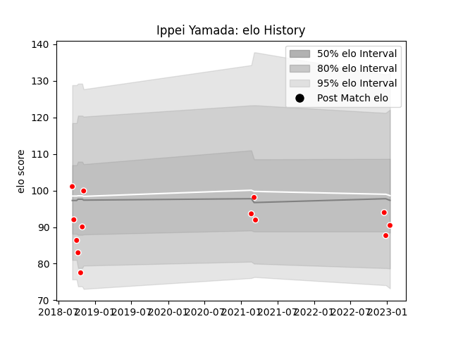

---  
layout: page  
title: Ippei Yamada  
date: 2022-12-28 12:56:20.059171  
categories: player  
---
# Ippei Yamada

## Positions: FH

## Current elo: 86.0

## Current Percentile: None

# Elo History

# Match History

| Team                  |   Appearances |   Win Rate |
|:----------------------|--------------:|-----------:|
| Chugoku Red Regulions |            12 |   0.166667 |

| Opponent                         |   Matches |   Win Rate |
|:---------------------------------|----------:|-----------:|
| Kyuden Voltex                    |         2 |        0   |
| NTT Docomo Red Hurricanes Osaka  |         2 |        0   |
| Skyactivs Hiroshima              |         2 |        0.5 |
| Hanazono Kintetsu Liners         |         1 |        0   |
| Kamaishi Seawaves                |         1 |        0   |
| Kurita Water Gush                |         1 |        0   |
| Mazda Blue Zoomers               |         1 |        1   |
| Mitsubishi Dynaboars             |         1 |        0   |
| Toyota Industries Shuttles Aichi |         1 |        0   |