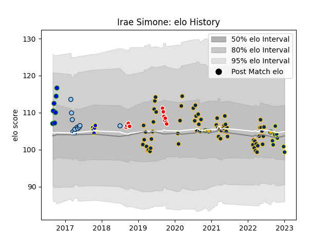

---  
layout: page  
title: Irae Simone  
date: 2023-02-02 18:54:44.812044  
categories: player  
---
# Irae Simone

## Positions: C

## Country: Australia

## Current elo: 82.0

## Current Percentile: 19.0

# Elo History

# Match History

| Team                     |   Appearances |   Win Rate |
|:-------------------------|--------------:|-----------:|
| Brumbies                 |            60 |   0.666667 |
| Canberra Vikings         |            12 |   0.666667 |
| Clermont Auvergne        |            11 |   0.5      |
| New South Wales Waratahs |            11 |   0.363636 |
| North Harbour Rays       |             7 |   0.857143 |
| Sydney Rays              |             5 |   0.4      |
| Australia                |             3 |   0.166667 |

| Opponent                 |   Matches |   Win Rate |
|:-------------------------|----------:|-----------:|
| Queensland Reds          |        12 |   0.5      |
| Western Force            |         9 |   0.888889 |
| New South Wales Waratahs |         8 |   1        |
| Melbourne Rebels         |         8 |   0.75     |
| Hurricanes               |         5 |   0.6      |
| Fijian Drua              |         5 |   0.8      |
| Blues                    |         5 |   0.2      |
| Chiefs                   |         4 |   0.75     |
| NSW Country Eagles       |         4 |   0.5      |
| Crusaders                |         4 |   0        |
| Queensland Country       |         3 |   0.333333 |
| Sunwolves                |         3 |   1        |
| Highlanders              |         3 |   0.333333 |
| Brisbane City            |         3 |   0.666667 |
| Melbourne Rising         |         3 |   1        |
| Sharks                   |         2 |   0.5      |
| Perth Spirit             |         2 |   1        |
| Perpignan                |         2 |   1        |
| Sydney Rays              |         2 |   1        |
| Argentina                |         2 |   0.25     |
| Lions                    |         2 |   0.5      |
| Jaguares                 |         2 |   0        |
| Canberra Vikings         |         2 |   0.5      |
| Lyon                     |         2 |   0.5      |
| Moana Pasifika           |         1 |   0        |
| Leicester Tigers         |         1 |   0        |
| La Rochelle              |         1 |   1        |
| New Zealand              |         1 |   0        |
| Pau                      |         1 |   1        |
| Greater Sydney Rams      |         1 |   1        |
| Bulls                    |         1 |   1        |
| Brumbies                 |         1 |   0        |
| Stade Francais Paris     |         1 |   0        |
| Stade Toulousain         |         1 |   0        |
| Brive                    |         1 |   0        |
| Bordeaux Begles          |         1 |   0.5      |