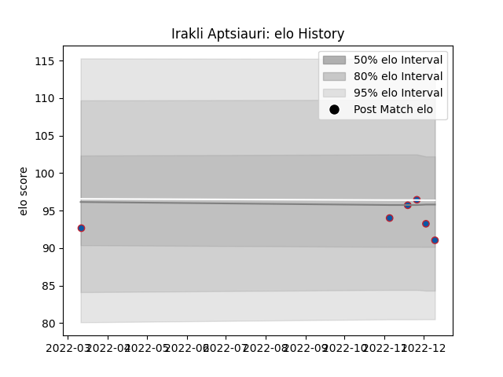

---  
layout: page  
title: Irakli Aptsiauri  
date: 2023-03-17 17:08:35.682366  
categories: player  
---
# Irakli Aptsiauri

## Positions: P

## Current elo: 94.0

## Current Percentile: 49.0

# Elo History

# Match History

| Team     |   Appearances |   Win Rate |
|:---------|--------------:|-----------:|
| Grenoble |            19 |   0.657895 |

| Opponent           |   Matches |   Win Rate |
|:-------------------|----------:|-----------:|
| Colomiers          |         3 |   0.333333 |
| Agen               |         2 |   0.5      |
| Aurillac           |         2 |   1        |
| Carcassonne        |         2 |   0.75     |
| Montauban          |         2 |   1        |
| Provence Rugby     |         2 |   0.25     |
| Beziers            |         1 |   1        |
| Biarritz Olympique |         1 |   0.5      |
| Massy              |         1 |   1        |
| Mont-de-Marsan     |         1 |   0        |
| Nevers             |         1 |   1        |
| Soyaux-Angouleme   |         1 |   1        |