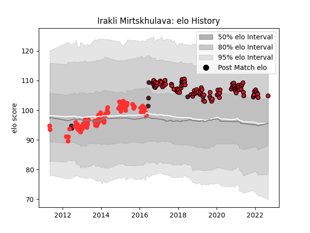

---  
layout: page  
title: Irakli Mirtskhulava  
date: 2023-03-21 18:16:20.946803  
categories: player  
---
# Irakli Mirtskhulava

Last updated: 2023-03-21
## Positions: P

## Country: Georgia

## Current elo: 105.0

## Current Percentile: 75.0

# Elo History

# Match History

| Team    |   Appearances |   Win Rate |
|:--------|--------------:|-----------:|
| Oyonnax |           101 |   0.608911 |
| Tarbes  |            87 |   0.517241 |
| Georgia |             6 |   0.583333 |

| Opponent                   |   Matches |   Win Rate |
|:---------------------------|----------:|-----------:|
| Aurillac                   |        11 |   0.727273 |
| Beziers                    |        11 |   0.545455 |
| Montauban                  |        10 |   0.5      |
| Provence Rugby             |        10 |   0.7      |
| Carcassonne                |        10 |   0.9      |
| Colomiers                  |        10 |   0.65     |
| Narbonne                   |         9 |   0.722222 |
| Albi                       |         9 |   0.666667 |
| Dax                        |         7 |   0.428571 |
| Perpignan                  |         7 |   0.142857 |
| Vannes                     |         6 |   0.333333 |
| Pau                        |         6 |   0.25     |
| Mont-de-Marsan             |         6 |   0.416667 |
| Lyon                       |         6 |   0.666667 |
| Agen                       |         6 |   0.5      |
| Biarritz Olympique         |         5 |   0.4      |
| Massy                      |         5 |   0.8      |
| Bourgoin-Jallieu           |         5 |   0.8      |
| Nevers                     |         5 |   1        |
| Grenoble                   |         4 |   0.5      |
| Auch                       |         4 |   0.5      |
| La Rochelle                |         4 |   0.625    |
| Brive                      |         4 |   0.25     |
| Soyaux-Angouleme           |         3 |   1        |
| Connacht                   |         2 |   0        |
| US Bressane                |         2 |   0.5      |
| Toulon                     |         2 |   0.5      |
| Stade Toulousain           |         2 |   0.25     |
| Rouen                      |         2 |   0.5      |
| Bayonne                    |         2 |   0        |
| Bordeaux Begles            |         2 |   0.5      |
| Oyonnax                    |         2 |   0.25     |
| Worcester Warriors         |         2 |   0.5      |
| Fiji                       |         1 |   1        |
| Racing 92                  |         1 |   0        |
| Roval Drome XV             |         1 |   1        |
| Samoa                      |         1 |   0.5      |
| Stade Francais Paris       |         1 |   1        |
| Montpellier Herault        |         1 |   0        |
| Tonga                      |         1 |   1        |
| Castres Olympique          |         1 |   0        |
| Clermont Auvergne          |         1 |   1        |
| Ukraine                    |         1 |   1        |
| United States of America   |         1 |   0        |
| Valence Romans Drome Rugby |         1 |   1        |
| Japan                      |         1 |   0        |