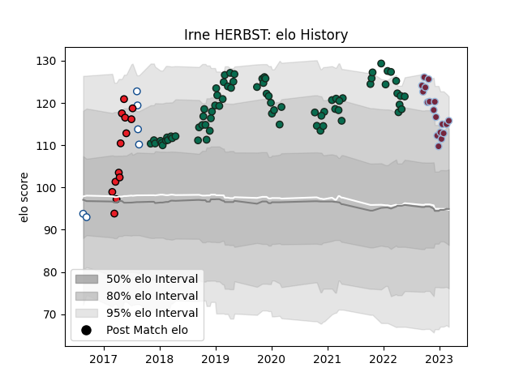

---  
layout: page  
title: Irne HERBST  
date: 2023-01-31 16:07:28.697618  
categories: player  
---
# Irne HERBST

## Positions: L

## Current elo: 114.0

## Current Percentile: 89.0

# Elo History

# Match History

| Team             |   Appearances |   Win Rate |
|:-----------------|--------------:|-----------:|
| Benetton Treviso |            67 |   0.365672 |
| Harlequins       |            16 |   0.5      |
| Southern Kings   |            13 |   0.384615 |
| Blue Bulls       |             6 |   0.5      |

| Opponent                 |   Matches |   Win Rate |
|:-------------------------|----------:|-----------:|
| Scarlets                 |         8 |   0.25     |
| Leinster                 |         8 |   0.1875   |
| Cardiff Blues            |         7 |   0.285714 |
| Munster                  |         5 |   0        |
| Connacht                 |         5 |   0        |
| Ulster                   |         4 |   0.125    |
| Sharks                   |         4 |   0.5      |
| Dragons                  |         4 |   0.875    |
| Zebre                    |         3 |   1        |
| Glasgow Warriors         |         3 |   0.333333 |
| Lions                    |         3 |   0        |
| Southern Kings           |         3 |   1        |
| Ospreys                  |         2 |   0        |
| Northampton Saints       |         2 |   0.5      |
| Racing 92                |         2 |   0.5      |
| Bath Rugby               |         2 |   0.5      |
| London Irish             |         2 |   0.5      |
| Sale Sharks              |         2 |   0.5      |
| Agen                     |         2 |   0.5      |
| Edinburgh                |         2 |   1        |
| Bulls                    |         2 |   0.5      |
| Cheetahs                 |         2 |   0.5      |
| Jaguares                 |         2 |   0.5      |
| Leicester Tigers         |         1 |   0        |
| Western Province         |         1 |   0        |
| Western Force            |         1 |   0        |
| Bristol Rugby            |         1 |   0        |
| Toulon                   |         1 |   0        |
| Stormers                 |         1 |   0        |
| Stade Francais Paris     |         1 |   1        |
| Brumbies                 |         1 |   0        |
| Saracens                 |         1 |   0        |
| Eastern Province Kings   |         1 |   1        |
| Queensland Reds          |         1 |   0        |
| Pumas                    |         1 |   1        |
| Exeter Chiefs            |         1 |   0        |
| Free State Cheetahs      |         1 |   0        |
| Newcastle Falcons        |         1 |   1        |
| New South Wales Waratahs |         1 |   1        |
| Natal Sharks             |         1 |   0        |
| Gloucester Rugby         |         1 |   1        |
| Melbourne Rebels         |         1 |   1        |
| Golden Lions             |         1 |   1        |
| Grenoble                 |         1 |   1        |
| Harlequins               |         1 |   1        |
| Lyon                     |         1 |   1        |