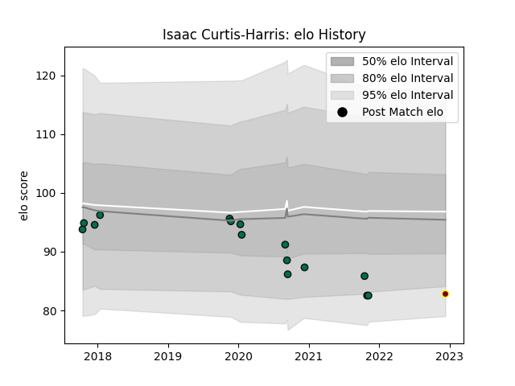

---  
layout: page  
title: Isaac Curtis-Harris  
date: 2022-12-18 16:35:53.195403  
categories: player  
---
# Isaac Curtis-Harris

## Positions: FL, N8

## Current elo: 83.0

## Current Percentile: None

# Elo History

# Match History

| Team         |   Appearances |   Win Rate |
|:-------------|--------------:|-----------:|
| London Irish |            15 |   0.266667 |
| Ampthill     |             1 |   0.5      |

| Opponent             |   Matches |   Win Rate |
|:---------------------|----------:|-----------:|
| Bayonne              |         2 |       0.5  |
| Saracens             |         2 |       0.25 |
| Scarlets             |         2 |       0    |
| Stade Francais Paris |         2 |       0.5  |
| Bristol Rugby        |         1 |       0    |
| Edinburgh            |         1 |       0    |
| Gloucester Rugby     |         1 |       0.5  |
| Harlequins           |         1 |       0    |
| Krasny Yar           |         1 |       1    |
| Richmond             |         1 |       0.5  |
| Sale Sharks          |         1 |       0    |
| Worcester Warriors   |         1 |       0    |