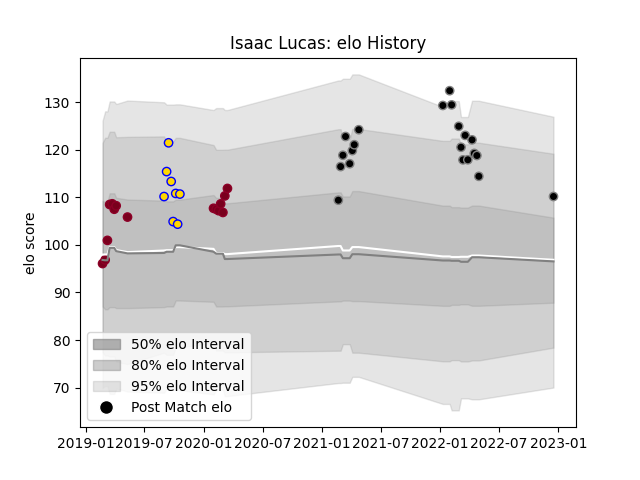

---  
layout: page  
title: Isaac Lucas  
date: 2023-03-17 17:33:50.286957  
categories: player  
---
# Isaac Lucas

## Positions: FH

## Current elo: 110.0

## Current Percentile: 83.0

# Elo History

# Match History

| Team             |   Appearances |   Win Rate |
|:-----------------|--------------:|-----------:|
| Black Rams Tokyo |            21 |   0.285714 |
| Queensland Reds  |            15 |   0.333333 |
| Brisbane City    |             8 |   0.4375   |

| Opponent                        |   Matches |   Win Rate |
|:--------------------------------|----------:|-----------:|
| Brumbies                        |         2 |        0.5 |
| Melbourne Rebels                |         2 |        0   |
| Western Force                   |         2 |        0   |
| Toyota Verblitz                 |         2 |        0   |
| Toshiba Brave Lupus Tokyo       |         2 |        0.5 |
| Tokyo Sungoliath                |         2 |        0   |
| Sunwolves                       |         2 |        1   |
| Shizuoka Blue Revs              |         2 |        0.5 |
| Saitama Wild Knights            |         2 |        0   |
| NTT Docomo Red Hurricanes Osaka |         2 |        0.5 |
| Yokohama Canon Eagles           |         2 |        0   |
| Kobelco Kobe Steelers           |         2 |        0   |
| Crusaders                       |         2 |        0   |
| Green Rockets Tokatsu           |         2 |        1   |
| Canberra Vikings                |         1 |        0   |
| Urayasu D-Rocks                 |         1 |        0   |
| Fijian Drua                     |         1 |        0.5 |
| Sydney Rays                     |         1 |        1   |
| Highlanders                     |         1 |        0   |
| Stormers                        |         1 |        1   |
| Lions                           |         1 |        0   |
| Sharks                          |         1 |        0   |
| Jaguares                        |         1 |        0   |
| Queensland Country              |         1 |        0   |
| New South Wales Waratahs        |         1 |        0   |
| Bulls                           |         1 |        1   |
| NSW Country Eagles              |         1 |        1   |
| Mitsubishi Dynaboars            |         1 |        0   |
| Melbourne Rising                |         1 |        1   |
| Hino Red Dolphins               |         1 |        1   |