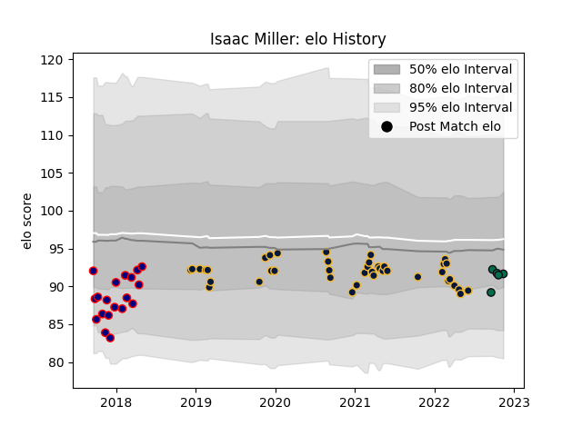

---  
layout: page  
title: Isaac Miller  
date: 2022-11-22 11:29:29.016031  
categories: player  
---
# Isaac Miller

## Positions: H

## Current elo: 92.0

## Current Percentile: 36.0

# Elo History

# Match History

| Team               |   Appearances |   Win Rate |
|:-------------------|--------------:|-----------:|
| Worcester Warriors |            41 |   0.268293 |
| London Scottish    |            19 |   0.289474 |
| London Irish       |             5 |   0        |

| Opponent             |   Matches |   Win Rate |
|:---------------------|----------:|-----------:|
| Bristol Rugby        |         6 |   0.166667 |
| Exeter Chiefs        |         5 |   0.2      |
| Leicester Tigers     |         5 |   0.4      |
| Wasps                |         4 |   0        |
| Sale Sharks          |         4 |   0        |
| Bath Rugby           |         3 |   0.333333 |
| Harlequins           |         3 |   0        |
| London Irish         |         3 |   0.333333 |
| Gloucester Rugby     |         2 |   0        |
| Hartpury College     |         2 |   0        |
| Jersey               |         2 |   0        |
| Dragons              |         2 |   0.5      |
| Newcastle Falcons    |         2 |   0        |
| Northampton Saints   |         2 |   0        |
| Nottingham           |         2 |   0.5      |
| Ealing Trailfinders  |         2 |   0        |
| Pau                  |         2 |   0.5      |
| RC Enisei            |         2 |   1        |
| Richmond             |         2 |   0.5      |
| Rotherham Titans     |         2 |   1        |
| Doncaster            |         2 |   0        |
| Stade Francais Paris |         1 |   1        |
| Cornish Pirates      |         1 |   1        |
| Ospreys              |         1 |   0        |
| Saracens             |         1 |   0        |
| Bedford              |         1 |   0.5      |
| Yorkshire Carnegie   |         1 |   0        |