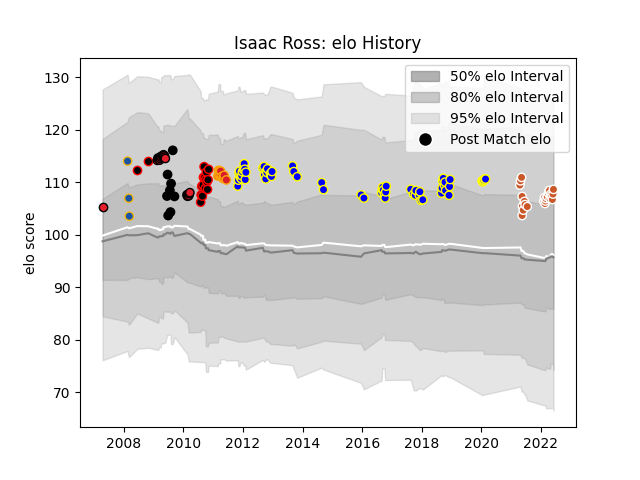

---  
layout: page  
title: Isaac Ross  
date: 2023-03-02 11:25:44.230671  
categories: player  
---
# Isaac Ross

## Positions: L

## Country: New Zealand

## Current elo: 109.0

## Current Percentile: 77.0

# Elo History

# Match History

| Team              |   Appearances |   Win Rate |
|:------------------|--------------:|-----------:|
| Urayasu D-Rocks   |            63 |   0.507937 |
| Austin Gilgronis  |            25 |   0.72     |
| Crusaders         |            20 |   0.675    |
| Canterbury        |            16 |   0.78125  |
| Chiefs            |            11 |   0.409091 |
| New Zealand       |             8 |   0.5      |
| Highlanders       |             3 |   0        |
| New Zealand Maori |             1 |   1        |

| Opponent                          |   Matches |   Win Rate |
|:----------------------------------|----------:|-----------:|
| Kobelco Kobe Steelers             |         6 |   0.25     |
| Munakata Sanix Blues              |         5 |   1        |
| Tokyo Sungoliath                  |         5 |   0        |
| Black Rams Tokyo                  |         5 |   0.7      |
| Shizuoka Blue Revs                |         5 |   0        |
| Highlanders                       |         5 |   0.6      |
| Toyota Verblitz                   |         4 |   0.5      |
| Kubota Spears Funabashi Tokyo-Bay |         4 |   0.25     |
| Seattle Seawolves                 |         4 |   1        |
| Hurricanes                        |         4 |   0.125    |
| Hanazono Kintetsu Liners          |         4 |   0.5      |
| Green Rockets Tokatsu             |         4 |   0.25     |
| South Africa                      |         3 |   0        |
| Toyota Industries Shuttles Aichi  |         3 |   1        |
| Mie Honda Heat                    |         3 |   0.666667 |
| Saitama Wild Knights              |         3 |   0.333333 |
| L. A. Giltinis                    |         3 |   0.333333 |
| Blues                             |         3 |   0.666667 |
| Wellington                        |         3 |   1        |
| Bulls                             |         3 |   0.333333 |
| Yokohama Canon Eagles             |         3 |   1        |
| New South Wales Waratahs          |         3 |   0.333333 |
| Coca-Cola Red Sparks              |         3 |   1        |
| Utah Warriors                     |         3 |   0.333333 |
| Queensland Reds                   |         3 |   0.333333 |
| Stormers                          |         2 |   1        |
| Old Glory DC                      |         2 |   0.5      |
| New England Free Jacks            |         2 |   0        |
| Australia                         |         2 |   1        |
| NTT Docomo Red Hurricanes Osaka   |         2 |   1        |
| Sharks                            |         2 |   1        |
| San Diego Legion                  |         2 |   1        |
| Lions                             |         2 |   1        |
| Houston SaberCats                 |         2 |   1        |
| Hino Red Dolphins                 |         2 |   1        |
| Toshiba Brave Lupus Tokyo         |         2 |   0        |
| France                            |         2 |   0.5      |
| Dallas Jackals                    |         2 |   1        |
| Chiefs                            |         2 |   1        |
| Waikato                           |         2 |   0.5      |
| Tasman                            |         1 |   0        |
| Taranaki                          |         1 |   0        |
| Southland                         |         1 |   1        |
| Western Force                     |         1 |   0.5      |
| Toronto Arrows                    |         1 |   1        |
| Auckland                          |         1 |   1        |
| Rugby New York                    |         1 |   1        |
| Hawke's Bay                       |         1 |   0.5      |
| Bay of Plenty                     |         1 |   1        |
| Brumbies                          |         1 |   0        |
| Cheetahs                          |         1 |   0        |
| Counties Manukau                  |         1 |   1        |
| Crusaders                         |         1 |   0        |
| Fiji                              |         1 |   1        |
| Italy                             |         1 |   1        |
| Rugby ATL                         |         1 |   1        |
| Manawatu                          |         1 |   1        |
| Melbourne Rebels                  |         1 |   1        |
| North Harbour                     |         1 |   1        |
| Northland                         |         1 |   1        |
| Otago                             |         1 |   1        |
| R.U. New York                     |         1 |   1        |
| NOLA Gold                         |         1 |   1        |