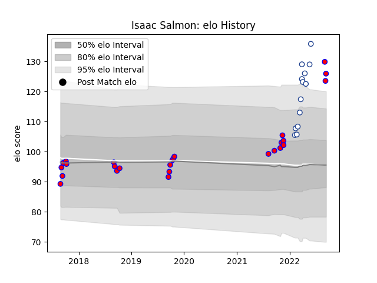

---  
layout: page  
title: Isaac Salmon  
date: 2023-02-24 02:29:14.123707  
categories: player  
---
# Isaac Salmon

## Positions: P

## Current elo: 126.0

## Current Percentile: 96.0

# Elo History

# Match History

| Team           |   Appearances |   Win Rate |
|:---------------|--------------:|-----------:|
| Tasman         |            26 |   0.769231 |
| Toronto Arrows |            13 |   0.538462 |

| Opponent               |   Matches |   Win Rate |
|:-----------------------|----------:|-----------:|
| Auckland               |         4 |       0.75 |
| Waikato                |         4 |       0.5  |
| Wellington             |         4 |       0.75 |
| North Harbour          |         3 |       1    |
| Hawke's Bay            |         3 |       1    |
| Rugby ATL              |         2 |       0    |
| Manawatu               |         2 |       0.5  |
| NOLA Gold              |         2 |       1    |
| New England Free Jacks |         2 |       0.5  |
| Counties Manukau       |         1 |       1    |
| Canterbury             |         1 |       0    |
| Utah Warriors          |         1 |       1    |
| Taranaki               |         1 |       1    |
| Seattle Seawolves      |         1 |       0    |
| Rugby New York         |         1 |       1    |
| Old Glory DC           |         1 |       1    |
| R.U. New York          |         1 |       1    |
| Otago                  |         1 |       1    |
| Bay of Plenty          |         1 |       1    |
| L. A. Giltinis         |         1 |       0    |
| Houston SaberCats      |         1 |       0    |
| Northland              |         1 |       1    |