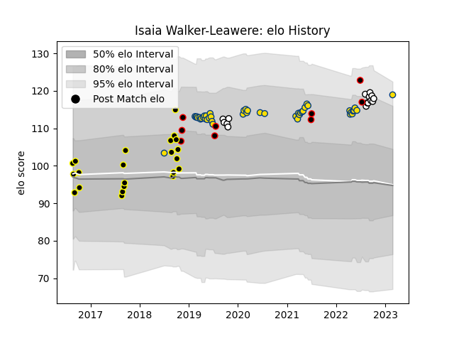

---  
layout: page  
title: Isaia Walker-Leawere  
date: 2023-03-21 18:23:41.219501  
categories: player  
---
# Isaia Walker-Leawere

Last updated: 2023-03-21
## Positions: L

## Country: New Zealand Maori

## Current elo: 116.0

## Current Percentile: 90.0

# Elo History

# Match History

| Team              |   Appearances |   Win Rate |
|:------------------|--------------:|-----------:|
| Hurricanes        |            47 |   0.659574 |
| Wellington        |            22 |   0.590909 |
| Hawke's Bay       |            15 |   0.566667 |
| New Zealand Maori |             9 |   0.777778 |

| Opponent                 |   Matches |   Win Rate |
|:-------------------------|----------:|-----------:|
| Blues                    |         7 |   0.428571 |
| Crusaders                |         5 |   0        |
| Highlanders              |         5 |   1        |
| Brumbies                 |         5 |   0.2      |
| Tasman                   |         4 |   0.25     |
| Taranaki                 |         4 |   0.75     |
| New South Wales Waratahs |         4 |   1        |
| Manawatu                 |         4 |   0.75     |
| Chiefs                   |         4 |   0.5      |
| Counties Manukau         |         3 |   1        |
| Canterbury               |         3 |   0.333333 |
| Waikato                  |         3 |   0.5      |
| Otago                    |         3 |   0.666667 |
| Bay of Plenty            |         3 |   0.333333 |
| Melbourne Rebels         |         3 |   1        |
| North Harbour            |         3 |   1        |
| Sunwolves                |         2 |   1        |
| Sharks                   |         2 |   1        |
| Wellington               |         2 |   0        |
| Samoa                    |         2 |   1        |
| Queensland Reds          |         2 |   1        |
| Auckland                 |         2 |   0        |
| Jaguares                 |         2 |   0.5      |
| Ireland                  |         2 |   0.5      |
| Hawke's Bay              |         2 |   1        |
| Fiji                     |         2 |   0.5      |
| Moana Pasifika           |         1 |   1        |
| Lions                    |         1 |   1        |
| Southland                |         1 |   1        |
| Stormers                 |         1 |   1        |
| Fijian Drua              |         1 |   1        |
| Chile                    |         1 |   1        |
| United States of America |         1 |   1        |
| Bulls                    |         1 |   1        |
| Brazil                   |         1 |   1        |
| Western Force            |         1 |   1        |