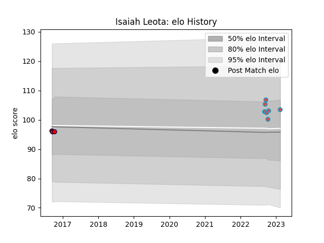

---  
layout: page  
title: Isaiah Leota  
date: 2023-02-15 22:15:08.820508  
categories: player  
---
# Isaiah Leota

## Positions: C

## Current elo: 103.0

## Current Percentile: 67.0

# Elo History

# Match History

| Team             |   Appearances |   Win Rate |
|:-----------------|--------------:|-----------:|
| Bourgoin-Jallieu |             7 |   0.714286 |
| Melbourne Rising |             3 |   0.333333 |

| Opponent            |   Matches |   Win Rate |
|:--------------------|----------:|-----------:|
| Suresnes            |         2 |        0.5 |
| Albi                |         1 |        0   |
| Brisbane City       |         1 |        1   |
| Carqueiranne-Hyères |         1 |        1   |
| Dax                 |         1 |        1   |
| NSW Country Eagles  |         1 |        0   |
| Narbonne            |         1 |        1   |
| Nice                |         1 |        1   |
| North Harbour Rays  |         1 |        0   |