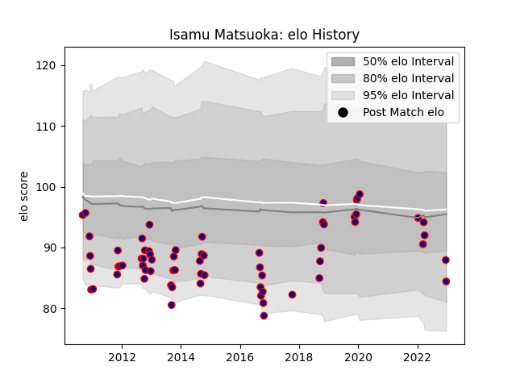

---  
layout: page  
title: Isamu Matsuoka  
date: 2023-03-09 10:13:59.458595  
categories: player  
---
# Isamu Matsuoka

## Positions: L

## Current elo: 78.0

## Current Percentile: 15.0

# Elo History

# Match History

| Team                     |   Appearances |   Win Rate |
|:-------------------------|--------------:|-----------:|
| Hanazono Kintetsu Liners |            91 |   0.483516 |

| Opponent                          |   Matches |   Win Rate |
|:----------------------------------|----------:|-----------:|
| Black Rams Tokyo                  |         7 |   0.714286 |
| Toshiba Brave Lupus Tokyo         |         6 |   0        |
| Kobelco Kobe Steelers             |         6 |   0.166667 |
| Tokyo Sungoliath                  |         6 |   0.166667 |
| NTT Docomo Red Hurricanes Osaka   |         6 |   0.666667 |
| Coca-Cola Red Sparks              |         5 |   1        |
| Urayasu D-Rocks                   |         5 |   0.4      |
| Toyota Verblitz                   |         5 |   0.2      |
| Munakata Sanix Blues              |         5 |   0.4      |
| Yokohama Canon Eagles             |         5 |   0.4      |
| Kubota Spears Funabashi Tokyo-Bay |         5 |   0.6      |
| Saitama Wild Knights              |         4 |   0        |
| Toyota Industries Shuttles Aichi  |         4 |   0.75     |
| Mitsubishi Dynaboars              |         4 |   0.25     |
| Kyuden Voltex                     |         3 |   1        |
| Shizuoka Blue Revs                |         3 |   0.666667 |
| Green Rockets Tokatsu             |         3 |   0        |
| Mie Honda Heat                    |         2 |   1        |
| Mazda Blue Zoomers                |         2 |   1        |
| Kurita Water Gush                 |         2 |   1        |
| Shimizu Blue Sharks               |         1 |   1        |
| Kamaishi Seawaves                 |         1 |   1        |
| Hino Red Dolphins                 |         1 |   1        |