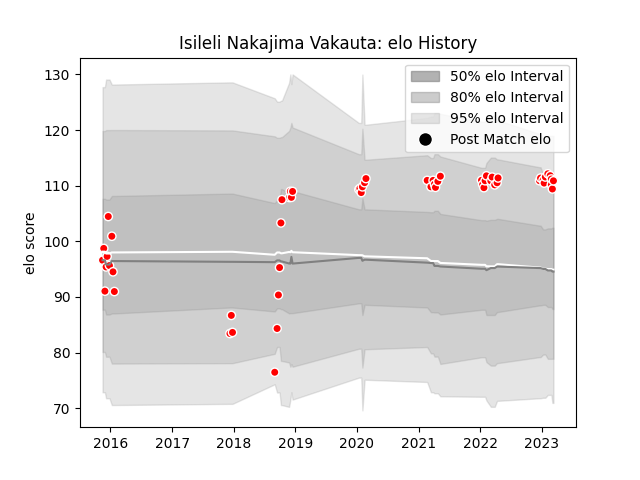

---  
layout: page  
title: Isileli Nakajima Vakauta  
date: 2022-12-28 12:56:54.009297  
categories: player  
---
# Isileli Nakajima Vakauta

## Positions: P, L

## Country: Japan

## Current elo: 97.0

## Current Percentile: 54.0

# Elo History

# Match History

| Team                  |   Appearances |   Win Rate |
|:----------------------|--------------:|-----------:|
| Kobelco Kobe Steelers |            30 |   0.683333 |
| Japan                 |             1 |   1        |

| Opponent                          |   Matches |   Win Rate |
|:----------------------------------|----------:|-----------:|
| Green Rockets Tokatsu             |         4 |   1        |
| Yokohama Canon Eagles             |         4 |   0.5      |
| Black Rams Tokyo                  |         3 |   1        |
| NTT Docomo Red Hurricanes Osaka   |         3 |   0.666667 |
| Saitama Wild Knights              |         3 |   0.166667 |
| Shizuoka Blue Revs                |         3 |   1        |
| Tokyo Sungoliath                  |         2 |   0.5      |
| Toshiba Brave Lupus Tokyo         |         2 |   0.5      |
| Coca-Cola Red Sparks              |         1 |   1        |
| Hanazono Kintetsu Liners          |         1 |   1        |
| Kubota Spears Funabashi Tokyo-Bay |         1 |   1        |
| Russia                            |         1 |   1        |
| Toyota Industries Shuttles Aichi  |         1 |   1        |
| Toyota Verblitz                   |         1 |   0        |
| Urayasu D-Rocks                   |         1 |   0        |