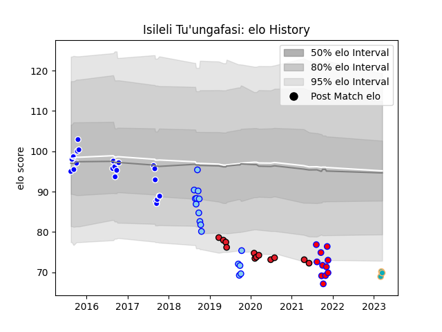

---  
layout: page  
title: Isileli Tu'ungafasi  
date: 2023-03-21 18:12:58.094052  
categories: player  
---
# Isileli Tu'ungafasi

Last updated: 2023-03-21
## Positions: P

## Current elo: 70.0

## Current Percentile: None

# Elo History

# Match History

| Team           |   Appearances |   Win Rate |
|:---------------|--------------:|-----------:|
| Auckland       |            23 |   0.5      |
| Northland      |            16 |   0.3125   |
| Crusaders      |            12 |   0.625    |
| Tasman         |            11 |   0.545455 |
| Moana Pasifika |             3 |   0        |

| Opponent                 |   Matches |   Win Rate |
|:-------------------------|----------:|-----------:|
| Waikato                  |         8 |   0.125    |
| Chiefs                   |         6 |   0.333333 |
| Canterbury               |         5 |   0        |
| Otago                    |         4 |   0.5      |
| Hawke's Bay              |         4 |   0.5      |
| Taranaki                 |         4 |   0.5      |
| Southland                |         4 |   0.875    |
| Bay of Plenty            |         4 |   0.5      |
| Counties Manukau         |         3 |   0.666667 |
| Tasman                   |         3 |   0.333333 |
| Northland                |         3 |   1        |
| Auckland                 |         2 |   0.5      |
| Wellington               |         2 |   0.5      |
| North Harbour            |         2 |   0        |
| New South Wales Waratahs |         2 |   0.5      |
| Manawatu                 |         2 |   1        |
| Western Force            |         2 |   0.5      |
| Sharks                   |         1 |   0.5      |
| Sunwolves                |         1 |   1        |
| Highlanders              |         1 |   1        |
| Brumbies                 |         1 |   0        |
| Blues                    |         1 |   1        |