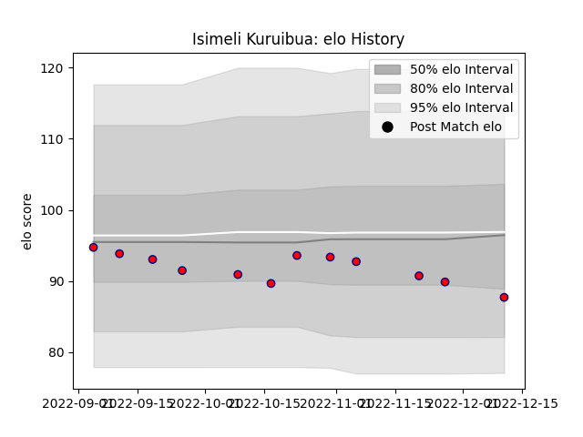

---  
layout: page  
title: Isimeli Kuruibua  
date: 2023-03-17 17:39:01.106767  
categories: player  
---
# Isimeli Kuruibua

## Positions: C, W

## Current elo: 100.0

## Current Percentile: 79.0

# Elo History

# Match History

| Team                       |   Appearances |   Win Rate |
|:---------------------------|--------------:|-----------:|
| Cognac Saint Jean d'Angély |            16 |          0 |
| Aurillac                   |             2 |          0 |

| Opponent                   |   Matches |   Win Rate |
|:---------------------------|----------:|-----------:|
| Blagnac                    |         2 |          0 |
| Carqueiranne-Hyères        |         2 |          0 |
| Dax                        |         2 |          0 |
| Rennes                     |         2 |          0 |
| Albi                       |         1 |          0 |
| Bourgoin-Jallieu           |         1 |          0 |
| Chambery                   |         1 |          0 |
| Narbonne                   |         1 |          0 |
| Nevers                     |         1 |          0 |
| Nice                       |         1 |          0 |
| Oyonnax                    |         1 |          0 |
| Tarbes                     |         1 |          0 |
| US Bressane                |         1 |          0 |
| Valence Romans Drome Rugby |         1 |          0 |