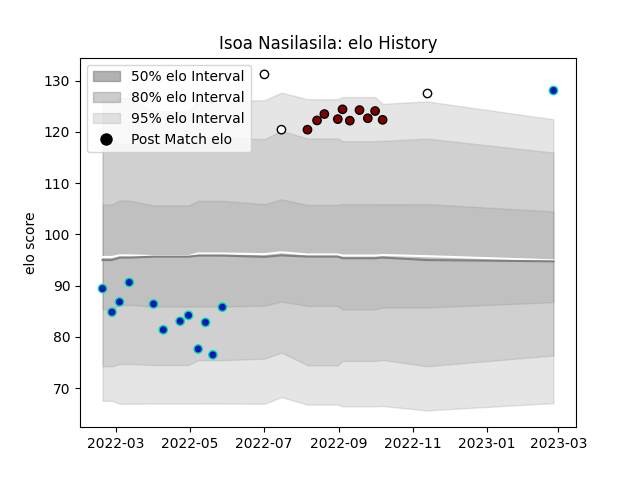

---  
layout: page  
title: Isoa Nasilasila  
date: 2023-03-21 18:16:18.156262  
categories: player  
---
# Isoa Nasilasila

Last updated: 2023-03-21
## Positions: L

## Country: Fiji

## Current elo: 129.0

## Current Percentile: 96.0

# Elo History

# Match History

| Team          |   Appearances |   Win Rate |
|:--------------|--------------:|-----------:|
| Fijian Drua   |            16 |   0.25     |
| North Harbour |            10 |   0.6      |
| Fiji          |             3 |   0.333333 |

| Opponent                 |   Matches |   Win Rate |
|:-------------------------|----------:|-----------:|
| New South Wales Waratahs |         3 |        0   |
| Auckland                 |         2 |        0   |
| Brumbies                 |         2 |        0   |
| Crusaders                |         2 |        0.5 |
| Queensland Reds          |         2 |        0   |
| Moana Pasifika           |         2 |        1   |
| Melbourne Rebels         |         1 |        1   |
| Tasman                   |         1 |        1   |
| Taranaki                 |         1 |        1   |
| Southland                |         1 |        1   |
| Samoa                    |         1 |        0   |
| Northland                |         1 |        1   |
| Manawatu                 |         1 |        1   |
| Bay of Plenty            |         1 |        0   |
| Ireland                  |         1 |        0   |
| Hurricanes               |         1 |        0   |
| Highlanders              |         1 |        0   |
| Counties Manukau         |         1 |        1   |
| Chiefs                   |         1 |        0   |
| Canterbury               |         1 |        0   |
| Blues                    |         1 |        0   |
| Tonga                    |         1 |        1   |