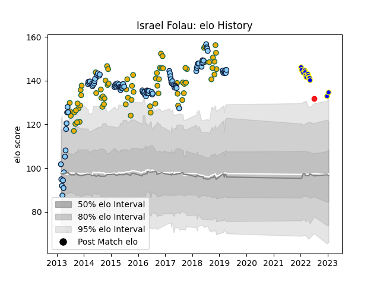

---  
layout: page  
title: Israel Folau  
date: 2022-12-28 12:54:30.139937  
categories: player  
---
# Israel Folau

## Positions: FB

## Country: Tonga

## Current elo: 118.0

## Current Percentile: 92.0

# Elo History

# Match History

| Team                     |   Appearances |   Win Rate |
|:-------------------------|--------------:|-----------:|
| New South Wales Waratahs |            95 |   0.552632 |
| Australia                |            74 |   0.466216 |
| Urayasu D-Rocks          |            13 |   0.307692 |
| Tonga                    |             1 |   0        |

| Opponent                          |   Matches |   Win Rate |
|:----------------------------------|----------:|-----------:|
| New Zealand                       |        18 |   0.138889 |
| Brumbies                          |        13 |   0.461538 |
| Argentina                         |        12 |   0.833333 |
| South Africa                      |        10 |   0.4      |
| Melbourne Rebels                  |        10 |   0.8      |
| Queensland Reds                   |         9 |   0.888889 |
| England                           |         8 |   0.125    |
| Crusaders                         |         7 |   0.428571 |
| Blues                             |         7 |   0.285714 |
| Highlanders                       |         7 |   0.428571 |
| Hurricanes                        |         6 |   0.333333 |
| Ireland                           |         6 |   0.333333 |
| Western Force                     |         6 |   0.666667 |
| Chiefs                            |         5 |   0.6      |
| Wales                             |         5 |   0.8      |
| Sunwolves                         |         4 |   0.75     |
| Stormers                          |         4 |   0.75     |
| Lions                             |         4 |   0.25     |
| France                            |         4 |   0.75     |
| British and Irish Lions           |         3 |   0.333333 |
| Italy                             |         3 |   1        |
| Bulls                             |         3 |   0.666667 |
| Cheetahs                          |         3 |   0.666667 |
| Scotland                          |         3 |   0.666667 |
| Sharks                            |         3 |   0.5      |
| Fiji                              |         3 |   0.666667 |
| Kobelco Kobe Steelers             |         2 |   0.5      |
| Southern Kings                    |         2 |   0.5      |
| Kubota Spears Funabashi Tokyo-Bay |         2 |   0        |
| Saitama Wild Knights              |         2 |   0        |
| Jaguares                          |         2 |   0        |
| Shizuoka Blue Revs                |         1 |   0        |
| Shimizu Blue Sharks               |         1 |   1        |
| Tokyo Sungoliath                  |         1 |   0        |
| Toshiba Brave Lupus Tokyo         |         1 |   1        |
| Toyota Verblitz                   |         1 |   0        |
| Green Rockets Tokatsu             |         1 |   1        |
| Yokohama Canon Eagles             |         1 |   0        |