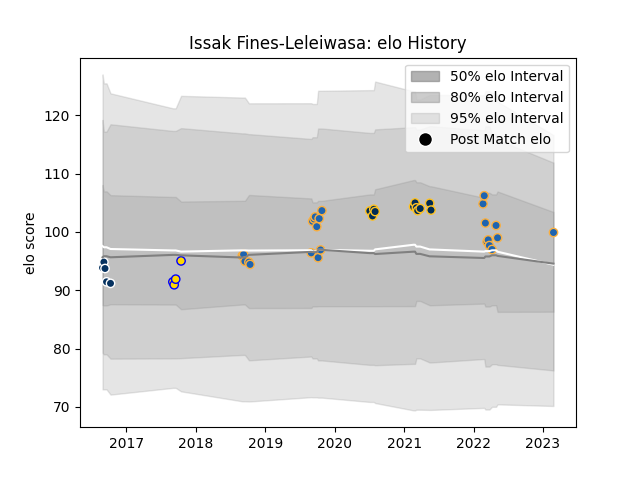

---  
layout: page  
title: Issak Fines-Leleiwasa  
date: 2023-03-02 11:23:33.273069  
categories: player  
---
# Issak Fines-Leleiwasa

## Positions: SH

## Current elo: 100.0

## Current Percentile: 62.0

# Elo History

# Match History

| Team               |   Appearances |   Win Rate |
|:-------------------|--------------:|-----------:|
| Western Force      |            24 |   0.583333 |
| Brumbies           |            11 |   0.727273 |
| Queensland Country |             5 |   0        |
| Brisbane City      |             4 |   0.75     |

| Opponent                 |   Matches |   Win Rate |
|:-------------------------|----------:|-----------:|
| Melbourne Rebels         |         5 |   0.8      |
| Canberra Vikings         |         5 |   0.6      |
| Melbourne Rising         |         4 |   0.75     |
| Brisbane City            |         4 |   0.75     |
| Fijian Drua              |         4 |   0.75     |
| Queensland Reds          |         3 |   0.333333 |
| New South Wales Waratahs |         3 |   0.666667 |
| Western Force            |         3 |   1        |
| Crusaders                |         2 |   0        |
| NSW Country Eagles       |         2 |   0.5      |
| Queensland Country       |         2 |   0.5      |
| Brumbies                 |         2 |   0        |
| Chiefs                   |         1 |   0        |
| North Harbour Rays       |         1 |   0        |
| Perth Spirit             |         1 |   0        |
| Sydney Rays              |         1 |   1        |
| Blues                    |         1 |   0        |