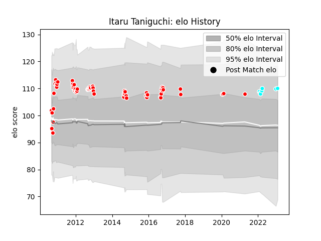

---  
layout: page  
title: Itaru Taniguchi  
date: 2023-02-02 19:04:29.296597  
categories: player  
---
# Itaru Taniguchi

## Positions: L, N8

## Country: Japan

## Current elo: 110.0

## Current Percentile: 80.0

# Elo History

# Match History

| Team                             |   Appearances |   Win Rate |
|:---------------------------------|--------------:|-----------:|
| Kobelco Kobe Steelers            |            65 |        0.7 |
| Toyota Industries Shuttles Aichi |             7 |        1   |
| Japan                            |             1 |        1   |

| Opponent                          |   Matches |   Win Rate |
|:----------------------------------|----------:|-----------:|
| Black Rams Tokyo                  |         6 |   0.833333 |
| NTT Docomo Red Hurricanes Osaka   |         5 |   0.6      |
| Toyota Verblitz                   |         5 |   0.6      |
| Tokyo Sungoliath                  |         5 |   0.4      |
| Shizuoka Blue Revs                |         5 |   0.9      |
| Yokohama Canon Eagles             |         5 |   0.8      |
| Coca-Cola Red Sparks              |         5 |   1        |
| Saitama Wild Knights              |         4 |   0        |
| Hanazono Kintetsu Liners          |         4 |   0.5      |
| Urayasu D-Rocks                   |         4 |   0.75     |
| Green Rockets Tokatsu             |         4 |   1        |
| Toyota Industries Shuttles Aichi  |         3 |   1        |
| Toshiba Brave Lupus Tokyo         |         3 |   0.333333 |
| Munakata Sanix Blues              |         3 |   0.666667 |
| Kyuden Voltex                     |         3 |   1        |
| Mie Honda Heat                    |         2 |   1        |
| Kubota Spears Funabashi Tokyo-Bay |         1 |   1        |
| Shimizu Blue Sharks               |         1 |   1        |
| Russia                            |         1 |   1        |
| Hino Red Dolphins                 |         1 |   1        |
| Chugoku Red Regulions             |         1 |   1        |
| Kurita Water Gush                 |         1 |   1        |
| Kamaishi Seawaves                 |         1 |   1        |