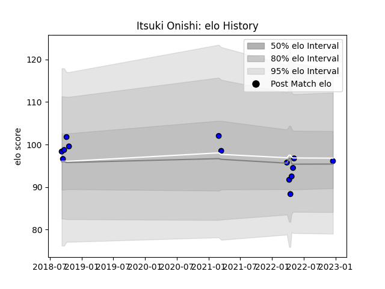

---  
layout: page  
title: Itsuki Onishi  
date: 2022-12-31 16:28:48.000736  
categories: player  
---
# Itsuki Onishi

## Positions: FL, N8

## Current elo: 96.0

## Current Percentile: 52.0

# Elo History

# Match History

| Team                 |   Appearances |   Win Rate |
|:---------------------|--------------:|-----------:|
| Saitama Wild Knights |            18 |          1 |

| Opponent                          |   Matches |   Win Rate |
|:----------------------------------|----------:|-----------:|
| Shizuoka Blue Revs                |         3 |          1 |
| Black Rams Tokyo                  |         2 |          1 |
| Toshiba Brave Lupus Tokyo         |         2 |          1 |
| Yokohama Canon Eagles             |         2 |          1 |
| Coca-Cola Red Sparks              |         1 |          1 |
| Green Rockets Tokatsu             |         1 |          1 |
| Hino Red Dolphins                 |         1 |          1 |
| Kobelco Kobe Steelers             |         1 |          1 |
| Kubota Spears Funabashi Tokyo-Bay |         1 |          1 |
| Mie Honda Heat                    |         1 |          1 |
| Mitsubishi Dynaboars              |         1 |          1 |
| NTT Docomo Red Hurricanes Osaka   |         1 |          1 |
| Urayasu D-Rocks                   |         1 |          1 |