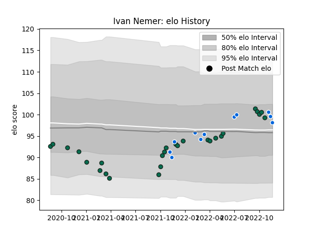

---  
layout: page  
title: Ivan Nemer  
date: 2022-11-16 11:40:56.891347  
categories: player  
---
# Ivan Nemer

## Positions: P

## Country: Italy

## Current elo: 99.0

## Current Percentile: 63.0

# Elo History

# Match History

| Team             |   Appearances |   Win Rate |
|:-----------------|--------------:|-----------:|
| Benetton Treviso |            27 |    0.37037 |
| Italy            |            10 |    0.4     |

| Opponent         |   Matches |   Win Rate |
|:-----------------|----------:|-----------:|
| Zebre            |         5 |   0.6      |
| Scarlets         |         4 |   0.25     |
| Connacht         |         3 |   0        |
| Glasgow Warriors |         3 |   0.666667 |
| Bulls            |         2 |   0        |
| Cardiff Blues    |         2 |   0.5      |
| Edinburgh        |         2 |   0.5      |
| Ospreys          |         1 |   0        |
| Uruguay          |         1 |   1        |
| Ulster           |         1 |   0        |
| Stormers         |         1 |   1        |
| Scotland         |         1 |   0        |
| Samoa            |         1 |   1        |
| Romania          |         1 |   1        |
| Argentina        |         1 |   0        |
| New Zealand      |         1 |   0        |
| Munster          |         1 |   0        |
| Australia        |         1 |   1        |
| Ireland          |         1 |   0        |
| Georgia          |         1 |   0        |
| France           |         1 |   0        |
| Dragons          |         1 |   1        |
| Leinster         |         1 |   0        |