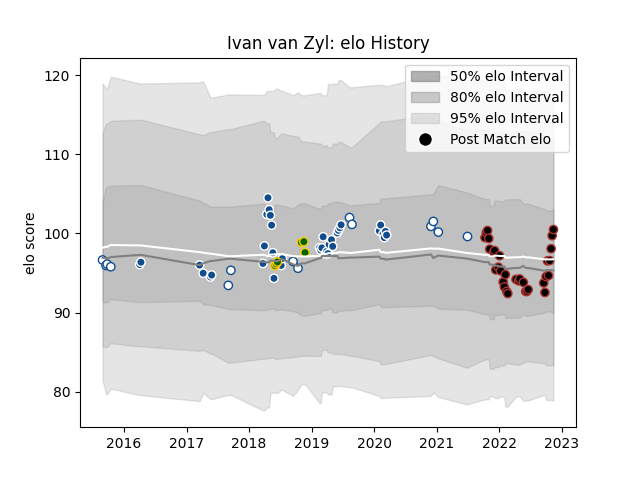

---  
layout: page  
title: Ivan van Zyl  
date: 2022-11-15 23:45:12.157826  
categories: player  
---
# Ivan van Zyl

## Positions: SH

## Country: South Africa

## Current elo: 100.0

## Current Percentile: 66.0

# Elo History

# Match History

| Team         |   Appearances |   Win Rate |
|:-------------|--------------:|-----------:|
| Bulls        |            37 |   0.459459 |
| Saracens     |            32 |   0.765625 |
| Blue Bulls   |            14 |   0.5      |
| South Africa |             6 |   0.5      |

| Opponent                 |   Matches |   Win Rate |
|:-------------------------|----------:|-----------:|
| Stormers                 |         5 |   0.4      |
| Sharks                   |         5 |   0.8      |
| Jaguares                 |         5 |   0.2      |
| Lions                    |         4 |   0.5      |
| Harlequins               |         4 |   1        |
| Western Province         |         4 |   0.25     |
| Pumas                    |         3 |   0.666667 |
| Northampton Saints       |         3 |   1        |
| Natal Sharks             |         3 |   0.333333 |
| London Irish             |         3 |   0.5      |
| Highlanders              |         3 |   0.5      |
| Bath Rugby               |         3 |   1        |
| Gloucester Rugby         |         3 |   0.333333 |
| Exeter Chiefs            |         3 |   0.666667 |
| England                  |         3 |   0.666667 |
| Golden Lions             |         2 |   0.5      |
| Newcastle Falcons        |         2 |   1        |
| Wasps                    |         2 |   0.5      |
| Wales                    |         2 |   0        |
| Sunwolves                |         2 |   0.5      |
| Sale Sharks              |         2 |   1        |
| Queensland Reds          |         2 |   0.5      |
| Griquas                  |         2 |   1        |
| Worcester Warriors       |         2 |   1        |
| Blues                    |         2 |   0.25     |
| Leicester Tigers         |         2 |   0.5      |
| Hurricanes               |         2 |   0        |
| New South Wales Waratahs |         1 |   1        |
| Crusaders                |         1 |   0        |
| Cheetahs                 |         1 |   1        |
| Melbourne Rebels         |         1 |   1        |
| Edinburgh                |         1 |   0        |
| Scotland                 |         1 |   1        |
| Brumbies                 |         1 |   0        |
| Southern Kings           |         1 |   1        |
| Brive                    |         1 |   1        |
| Bristol Rugby            |         1 |   1        |
| Chiefs                   |         1 |   0        |