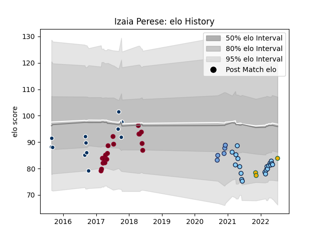

---  
layout: page  
title: Izaia Perese  
date: 2023-03-17 17:42:32.600665  
categories: player  
---
# Izaia Perese

## Positions: C, W

## Country: Australia

## Current elo: 85.0

## Current Percentile: 19.0

# Elo History

# Match History

| Team                     |   Appearances |   Win Rate |
|:-------------------------|--------------:|-----------:|
| New South Wales Waratahs |            24 |   0.333333 |
| Queensland Reds          |            19 |   0.263158 |
| Queensland Country       |            12 |   0.25     |
| Bayonne                  |             5 |   0.4      |
| Australia                |             3 |   0        |

| Opponent                 |   Matches |   Win Rate |
|:-------------------------|----------:|-----------:|
| Brumbies                 |         5 |   0.2      |
| Hurricanes               |         5 |   0        |
| Western Force            |         4 |   0.5      |
| Chiefs                   |         4 |   0        |
| Melbourne Rebels         |         4 |   0.5      |
| Highlanders              |         3 |   0        |
| Queensland Reds          |         3 |   0        |
| New South Wales Waratahs |         3 |   0        |
| Brisbane City            |         3 |   0.333333 |
| Crusaders                |         3 |   0.333333 |
| Fijian Drua              |         3 |   1        |
| Melbourne Rising         |         2 |   0        |
| England                  |         2 |   0        |
| Lions                    |         2 |   0.5      |
| Canberra Vikings         |         2 |   0        |
| Racing 92                |         1 |   0        |
| Toulon                   |         1 |   1        |
| Sydney Stars             |         1 |   0        |
| Stade Toulousain         |         1 |   0        |
| Southern Kings           |         1 |   1        |
| Sharks                   |         1 |   1        |
| Scotland                 |         1 |   0        |
| Greater Sydney Rams      |         1 |   1        |
| Perth Spirit             |         1 |   0        |
| Clermont Auvergne        |         1 |   1        |
| NSW Country Eagles       |         1 |   1        |
| Moana Pasifika           |         1 |   1        |
| Brive                    |         1 |   0        |
| Jaguares                 |         1 |   0        |
| North Harbour Rays       |         1 |   0        |