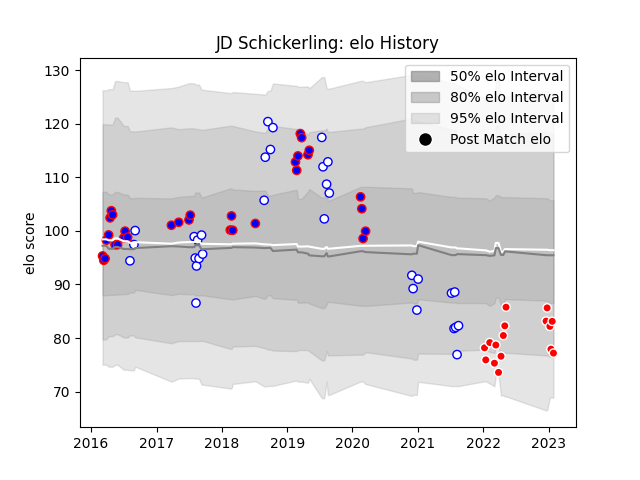

---  
layout: page  
title: JD Schickerling  
date: 2022-12-31 15:55:09.038266  
categories: player  
---
# JD Schickerling

## Positions: L

## Current elo: 105.0

## Current Percentile: 75.0

# Elo History

# Match History

| Team                  |   Appearances |   Win Rate |
|:----------------------|--------------:|-----------:|
| Stormers              |            32 |   0.609375 |
| Western Province      |            32 |   0.546875 |
| Kobelco Kobe Steelers |            12 |   0.5      |

| Opponent                          |   Matches |   Win Rate |
|:----------------------------------|----------:|-----------:|
| Free State Cheetahs               |         7 |   0.571429 |
| Pumas                             |         6 |   0.75     |
| Blue Bulls                        |         6 |   0.5      |
| Jaguares                          |         5 |   0.8      |
| Golden Lions                      |         4 |   0.5      |
| Sunwolves                         |         4 |   0.875    |
| Sharks                            |         4 |   0.5      |
| Natal Sharks                      |         4 |   0.5      |
| Griquas                           |         4 |   0.25     |
| Lions                             |         3 |   0.666667 |
| Yokohama Canon Eagles             |         3 |   0.333333 |
| Cheetahs                          |         3 |   1        |
| Green Rockets Tokatsu             |         2 |   1        |
| Urayasu D-Rocks                   |         2 |   0.5      |
| Bulls                             |         2 |   0.5      |
| New South Wales Waratahs          |         2 |   0        |
| Hurricanes                        |         2 |   0        |
| Kubota Spears Funabashi Tokyo-Bay |         1 |   0        |
| Chiefs                            |         1 |   0        |
| Melbourne Rebels                  |         1 |   1        |
| Crusaders                         |         1 |   0        |
| Eastern Province Kings            |         1 |   1        |
| Queensland Reds                   |         1 |   1        |
| Brumbies                          |         1 |   1        |
| Blues                             |         1 |   0        |
| Tokyo Sungoliath                  |         1 |   0        |
| Toshiba Brave Lupus Tokyo         |         1 |   0        |
| Hanazono Kintetsu Liners          |         1 |   1        |
| Western Force                     |         1 |   1        |
| Black Rams Tokyo                  |         1 |   1        |