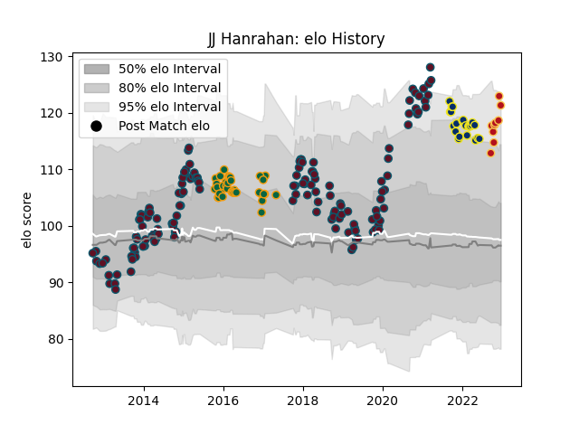

---  
layout: page  
title: JJ Hanrahan  
date: 2022-12-12 15:33:00.412193  
categories: player  
---
# JJ Hanrahan

## Positions: FH, C

## Current elo: 123.0

## Current Percentile: 92.0

# Elo History

# Match History

| Team               |   Appearances |   Win Rate |
|:-------------------|--------------:|-----------:|
| Munster            |           143 |   0.681818 |
| Northampton Saints |            38 |   0.513158 |
| Clermont Auvergne  |            23 |   0.521739 |
| Dragons            |             8 |   0.375    |

| Opponent             |   Matches |   Win Rate |
|:---------------------|----------:|-----------:|
| Leinster             |        16 |   0.1875   |
| Zebre                |        12 |   1        |
| Edinburgh            |        12 |   0.666667 |
| Scarlets             |        12 |   0.708333 |
| Cardiff Blues        |        11 |   0.818182 |
| Ospreys              |        11 |   0.818182 |
| Glasgow Warriors     |        11 |   0.545455 |
| Racing 92            |        10 |   0.4      |
| Benetton Treviso     |         9 |   0.666667 |
| Connacht             |         9 |   0.777778 |
| Dragons              |         9 |   0.888889 |
| Saracens             |         8 |   0.375    |
| Ulster               |         7 |   0.428571 |
| Castres Olympique    |         6 |   0.5      |
| Sale Sharks          |         5 |   0.8      |
| Leicester Tigers     |         5 |   0.4      |
| Gloucester Rugby     |         5 |   1        |
| Perpignan            |         4 |   0.75     |
| Exeter Chiefs        |         4 |   0.375    |
| Southern Kings       |         4 |   1        |
| Toulon               |         4 |   0.5      |
| Stade Toulousain     |         3 |   0.666667 |
| Newcastle Falcons    |         3 |   0.333333 |
| Stade Francais Paris |         2 |   0.5      |
| Wasps                |         2 |   0        |
| Worcester Warriors   |         2 |   0.5      |
| Bath Rugby           |         2 |   1        |
| Montpellier Herault  |         2 |   0.5      |
| Lyon                 |         2 |   0.5      |
| Harlequins           |         2 |   1        |
| Clermont Auvergne    |         2 |   0        |
| Cheetahs             |         2 |   1        |
| Brive                |         2 |   0.5      |
| Bordeaux Begles      |         2 |   0.5      |
| Biarritz Olympique   |         2 |   1        |
| London Irish         |         2 |   0.5      |
| Pau                  |         1 |   0        |
| Munster              |         1 |   1        |
| Lions                |         1 |   0        |
| La Rochelle          |         1 |   1        |
| Stormers             |         1 |   0        |
| Bristol Rugby        |         1 |   1        |