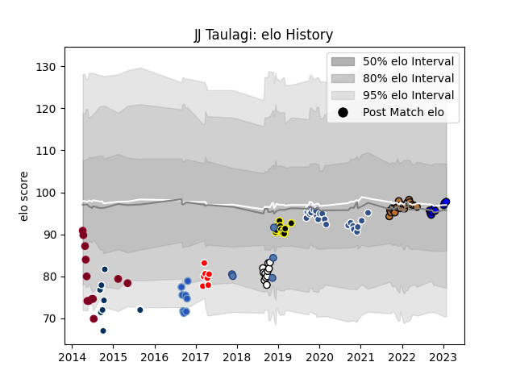

---  
layout: page  
title: JJ Taulagi  
date: 2023-02-02 18:45:14.370782  
categories: player  
---
# JJ Taulagi

## Positions: FB, W

## Country: Samoa

## Current elo: 98.0

## Current Percentile: 54.0

# Elo History

# Match History

| Team                 |   Appearances |   Win Rate |
|:---------------------|--------------:|-----------:|
| Agen                 |            23 |   0.152174 |
| Narbonne             |            20 |   0.275    |
| Queensland Reds      |            12 |   0.166667 |
| Hawke's Bay          |            11 |   0.454545 |
| Mont-de-Marsan       |            11 |   0.454545 |
| Massy                |             9 |   0.444444 |
| Queensland Country   |             9 |   0.222222 |
| Munakata Sanix Blues |             8 |   0.625    |
| Sunwolves            |             7 |   0        |
| Samoa                |             5 |   0.2      |

| Opponent                          |   Matches |   Win Rate |
|:----------------------------------|----------:|-----------:|
| Oyonnax                           |         4 |   0        |
| Vannes                            |         4 |   0.375    |
| Bayonne                           |         4 |   0.25     |
| US Bressane                       |         4 |   0.5      |
| Provence Rugby                    |         4 |   0.75     |
| Nevers                            |         4 |   0.25     |
| Castres Olympique                 |         3 |   0        |
| Aurillac                          |         3 |   0.333333 |
| Bordeaux Begles                   |         3 |   0        |
| Clermont Auvergne                 |         3 |   0        |
| Crusaders                         |         3 |   0        |
| Montauban                         |         3 |   0.666667 |
| Carcassonne                       |         3 |   0.666667 |
| Melbourne Rebels                  |         2 |   0.5      |
| Mont-de-Marsan                    |         2 |   0        |
| Agen                              |         2 |   0.5      |
| Otago                             |         2 |   0.5      |
| Pau                               |         2 |   0        |
| Stade Francais Paris              |         2 |   0.5      |
| Stade Toulousain                  |         2 |   0        |
| Sydney Stars                      |         2 |   0.5      |
| Highlanders                       |         2 |   0.5      |
| Melbourne Rising                  |         2 |   0        |
| Brumbies                          |         2 |   0        |
| Colomiers                         |         2 |   0        |
| Beziers                           |         2 |   0        |
| Western Force                     |         2 |   0        |
| Hanazono Kintetsu Liners          |         1 |   1        |
| Stormers                          |         1 |   0        |
| Romania                           |         1 |   0        |
| Rouen                             |         1 |   1        |
| Shizuoka Blue Revs                |         1 |   0        |
| Southern Kings                    |         1 |   0        |
| Southland                         |         1 |   1        |
| Spain                             |         1 |   1        |
| Brisbane City                     |         1 |   0        |
| Blues                             |         1 |   0        |
| Biarritz Olympique                |         1 |   0        |
| Counties Manukau                  |         1 |   0        |
| Tasman                            |         1 |   0        |
| Tokyo Sungoliath                  |         1 |   0        |
| Toshiba Brave Lupus Tokyo         |         1 |   1        |
| Toyota Industries Shuttles Aichi  |         1 |   1        |
| Georgia                           |         1 |   0        |
| United States of America          |         1 |   0        |
| Bay of Plenty                     |         1 |   1        |
| Waikato                           |         1 |   0        |
| Racing 92                         |         1 |   0.5      |
| Brive                             |         1 |   0        |
| Perth Spirit                      |         1 |   0        |
| England                           |         1 |   0        |
| Hurricanes                        |         1 |   0        |
| Kubota Spears Funabashi Tokyo-Bay |         1 |   0        |
| Lyon                              |         1 |   0        |
| Manawatu                          |         1 |   1        |
| Greater Sydney Rams               |         1 |   1        |
| Coca-Cola Red Sparks              |         1 |   1        |
| Mie Honda Heat                    |         1 |   1        |
| Chiefs                            |         1 |   0        |
| Cheetahs                          |         1 |   0        |
| Montpellier Herault               |         1 |   1        |
| Canterbury                        |         1 |   0        |
| New South Wales Waratahs          |         1 |   0        |
| North Harbour                     |         1 |   0        |
| North Harbour Rays                |         1 |   0        |
| Northland                         |         1 |   1        |
| Canberra Vikings                  |         1 |   0        |
| Bulls                             |         1 |   0        |
| Edinburgh                         |         1 |   0        |