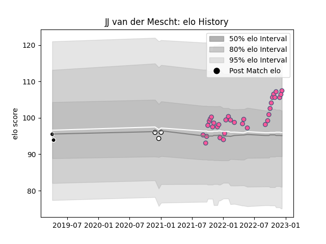

---  
layout: page  
title: JJ van der Mescht  
date: 2022-12-18 16:36:56.006785  
categories: player  
---
# JJ van der Mescht

## Positions: L

## Current elo: 105.0

## Current Percentile: 84.0

# Elo History

# Match History

| Team                 |   Appearances |   Win Rate |
|:---------------------|--------------:|-----------:|
| Stade Francais Paris |            34 |   0.514706 |
| Natal Sharks         |             3 |   0.666667 |
| Sharks               |             2 |   0.5      |

| Opponent            |   Matches |   Win Rate |
|:--------------------|----------:|-----------:|
| Toulon              |         3 |   0.333333 |
| Stade Toulousain    |         3 |   0.833333 |
| Clermont Auvergne   |         3 |   0.666667 |
| Perpignan           |         3 |   1        |
| Pau                 |         3 |   0.666667 |
| La Rochelle         |         3 |   0.666667 |
| Lions               |         2 |   0.5      |
| Brive               |         2 |   0.5      |
| Castres Olympique   |         2 |   0.5      |
| Montpellier Herault |         2 |   0        |
| Lyon                |         2 |   0.5      |
| Racing 92           |         1 |   0        |
| Pumas               |         1 |   1        |
| Bayonne             |         1 |   1        |
| Benetton Treviso    |         1 |   1        |
| Griquas             |         1 |   1        |
| Golden Lions        |         1 |   0        |
| Connacht            |         1 |   0        |
| Bristol Rugby       |         1 |   0        |
| Bordeaux Begles     |         1 |   0        |
| Biarritz Olympique  |         1 |   0        |
| Jaguares            |         1 |   0        |