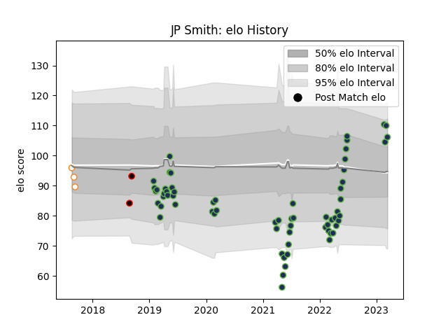

---  
layout: page  
title: JP Smith  
date: 2023-03-16 21:09:05.903087  
categories: player  
---
# JP Smith

## Positions: SH

## Current elo: 106.0

## Current Percentile: 87.0

# Elo History

# Match History

| Team                   |   Appearances |   Win Rate |
|:-----------------------|--------------:|-----------:|
| Seattle Seawolves      |            64 |   0.539062 |
| Free State Cheetahs    |             3 |   0.333333 |
| Eastern Province Kings |             2 |   0        |

| Opponent               |   Matches |   Win Rate |
|:-----------------------|----------:|-----------:|
| San Diego Legion       |         9 |   0.555556 |
| Houston SaberCats      |         8 |   0.75     |
| Utah Warriors          |         7 |   0.642857 |
| Rugby New York         |         5 |   0.4      |
| Toronto Arrows         |         5 |   0.6      |
| R.U. New York          |         5 |   0.4      |
| L. A. Giltinis         |         4 |   0.25     |
| NOLA Gold              |         4 |   0.5      |
| Dallas Jackals         |         3 |   1        |
| Austin Gilgronis       |         3 |   0        |
| New England Free Jacks |         3 |   0.333333 |
| Austin Elite Rugby     |         2 |   1        |
| Glendale Raptors       |         2 |   1        |
| Old Glory DC           |         2 |   0        |
| Rugby ATL              |         2 |   0.5      |
| Natal Sharks           |         1 |   0        |
| Leopards               |         1 |   0        |
| Boland Cavaliers       |         1 |   0        |
| Blue Bulls             |         1 |   1        |
| Western Province       |         1 |   0        |