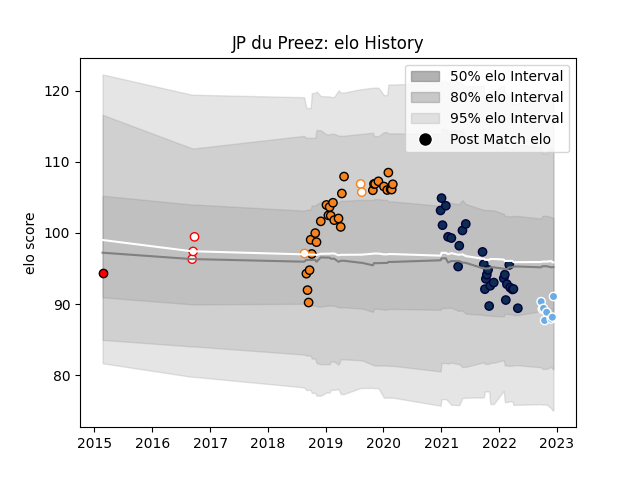

---  
layout: page  
title: JP du Preez  
date: 2023-01-06 00:18:59.349010  
categories: player  
---
# JP du Preez

## Positions: L

## Current elo: 100.0

## Current Percentile: 29.0

# Elo History

# Match History

| Team                |   Appearances |   Win Rate |
|:--------------------|--------------:|-----------:|
| Cheetahs            |            29 |   0.362069 |
| Sale Sharks         |            28 |   0.642857 |
| Glasgow Warriors    |            10 |   0.7      |
| Free State Cheetahs |             6 |   0.5      |
| Golden Lions        |             4 |   0.75     |
| Lions               |             1 |   0        |

| Opponent               |   Matches |   Win Rate |
|:-----------------------|----------:|-----------:|
| Bath Rugby             |         5 |   0.7      |
| Southern Kings         |         5 |   1        |
| Gloucester Rugby       |         4 |   0.75     |
| Worcester Warriors     |         4 |   0.75     |
| Ospreys                |         4 |   0.25     |
| Zebre                  |         4 |   0.75     |
| Cardiff Blues          |         4 |   0.5      |
| Edinburgh              |         3 |   0.666667 |
| Connacht               |         3 |   0        |
| Harlequins             |         3 |   1        |
| Leicester Tigers       |         3 |   0.666667 |
| Dragons                |         2 |   0.5      |
| Newcastle Falcons      |         2 |   1        |
| Blue Bulls             |         2 |   0.5      |
| Ulster                 |         2 |   0.25     |
| Sharks                 |         2 |   0        |
| Scarlets               |         2 |   0        |
| Saracens               |         2 |   0        |
| Northampton Saints     |         2 |   1        |
| Natal Sharks           |         2 |   0.5      |
| Munster                |         2 |   0        |
| Glasgow Warriors       |         2 |   0        |
| Exeter Chiefs          |         2 |   0        |
| Leinster               |         2 |   0        |
| Eastern Province Kings |         1 |   1        |
| London Irish           |         1 |   0.5      |
| Benetton Treviso       |         1 |   1        |
| Pumas                  |         1 |   1        |
| Griquas                |         1 |   1        |
| Golden Lions           |         1 |   0        |
| Bulls                  |         1 |   1        |
| Free State Cheetahs    |         1 |   0        |
| Wasps                  |         1 |   0        |
| Western Province       |         1 |   1        |