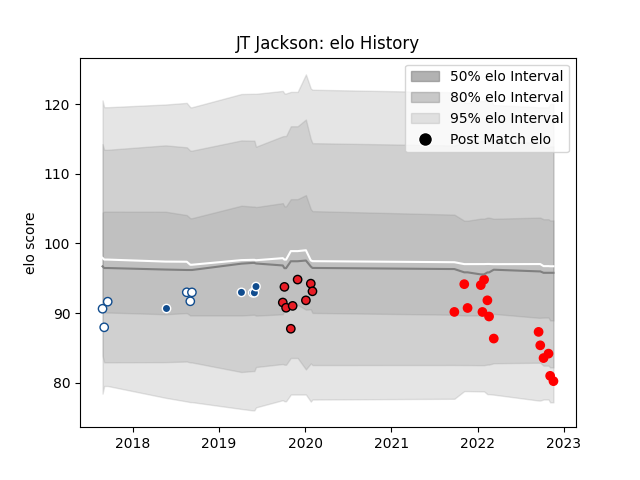

---  
layout: page  
title: JT Jackson  
date: 2023-02-02 19:03:03.543149  
categories: player  
---
# JT Jackson

## Positions: C, FH

## Current elo: 88.0

## Current Percentile: 33.0

# Elo History

# Match History

| Team           |   Appearances |   Win Rate |
|:---------------|--------------:|-----------:|
| Rouen          |            27 |   0.296296 |
| Blue Bulls     |            10 |   0.4      |
| Southern Kings |             9 |   0.111111 |
| Bulls          |             5 |   0.2      |

| Opponent            |   Matches |   Win Rate |
|:--------------------|----------:|-----------:|
| Carcassonne         |         3 |   0        |
| Grenoble            |         3 |   0.333333 |
| Golden Lions        |         3 |   0.333333 |
| Agen                |         2 |   0.5      |
| Free State Cheetahs |         2 |   0.5      |
| Provence Rugby      |         2 |   0.5      |
| Oyonnax             |         2 |   0        |
| Nevers              |         2 |   0        |
| Montauban           |         2 |   0.5      |
| Jaguares            |         2 |   0        |
| Aurillac            |         2 |   0.5      |
| Griquas             |         2 |   1        |
| Cheetahs            |         2 |   0        |
| Edinburgh           |         1 |   0        |
| Natal Sharks        |         1 |   0        |
| Vannes              |         1 |   1        |
| Ulster              |         1 |   0        |
| US Bressane         |         1 |   0        |
| Soyaux-Angouleme    |         1 |   1        |
| Pumas               |         1 |   0        |
| Bayonne             |         1 |   0        |
| Beziers             |         1 |   0        |
| Ospreys             |         1 |   1        |
| Biarritz Olympique  |         1 |   1        |
| Narbonne            |         1 |   0        |
| Connacht            |         1 |   0        |
| Munster             |         1 |   0        |
| Blues               |         1 |   0.5      |
| Mont-de-Marsan      |         1 |   0        |
| Brumbies            |         1 |   0        |
| Highlanders         |         1 |   0.5      |
| Cardiff Blues       |         1 |   0        |
| Colomiers           |         1 |   0        |
| Glasgow Warriors    |         1 |   0        |
| Western Province    |         1 |   0        |