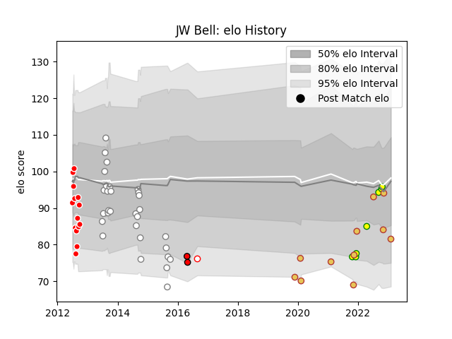

---  
layout: page  
title: JW Bell  
date: 2022-11-15 23:45:35.372333  
categories: player  
---
# JW Bell

## Positions: FB, W

## Country: Spain

## Current elo: 95.0

## Current Percentile: 28.0

# Elo History

# Match History

| Team                     |   Appearances |   Win Rate |
|:-------------------------|--------------:|-----------:|
| Pumas                    |            24 |   0.645833 |
| Valke                    |            14 |   0.25     |
| Spain                    |            10 |   0.7      |
| Castilla y Leon Iberians |             5 |   1        |
| Lions                    |             2 |   0.5      |

| Opponent               |   Matches |   Win Rate |
|:-----------------------|----------:|-----------:|
| Eastern Province Kings |         5 |   0.4      |
| Natal Sharks           |         4 |   0.5      |
| Leopards               |         4 |   0.5      |
| Griffons               |         4 |   0.75     |
| Free State Cheetahs    |         3 |   0.833333 |
| Boland Cavaliers       |         3 |   0.5      |
| Golden Lions           |         3 |   0        |
| SWD Eagles             |         3 |   0.333333 |
| Brussels Devils        |         3 |   1        |
| Border Bulldogs        |         3 |   1        |
| Valke                  |         2 |   1        |
| Russia                 |         2 |   1        |
| Pumas                  |         2 |   0        |
| Southern Kings         |         1 |   1        |
| Netherlands            |         1 |   1        |
| Tonga                  |         1 |   0        |
| Portugal               |         1 |   1        |
| Blue Bulls             |         1 |   0        |
| Hurricanes             |         1 |   0        |
| Namibia                |         1 |   1        |
| Lusitanos XV           |         1 |   1        |
| Hong Kong              |         1 |   1        |
| Georgia                |         1 |   0        |
| Fiji                   |         1 |   0        |
| Delta                  |         1 |   1        |
| Canada                 |         1 |   1        |
| Western Province       |         1 |   0        |