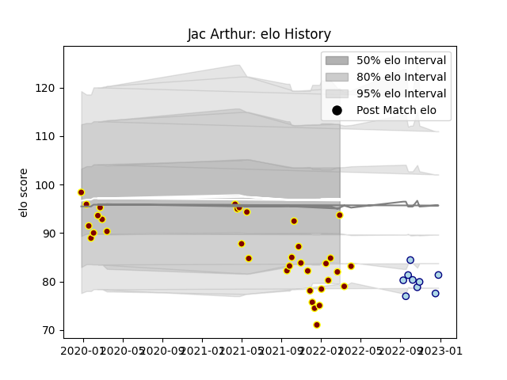

---  
layout: page  
title: Jac Arthur  
date: 2022-12-28 12:53:19.143816  
categories: player  
---
# Jac Arthur

## Positions: FL

## Current elo: 94.0

## Current Percentile: 7.0

# Elo History

# Match History

| Team     |   Appearances |   Win Rate |
|:---------|--------------:|-----------:|
| Ampthill |            35 |   0.514286 |
| Bedford  |             9 |   0.555556 |

| Opponent            |   Matches |   Win Rate |
|:--------------------|----------:|-----------:|
| Cornish Pirates     |         5 |   0.5      |
| Coventry            |         5 |   0.4      |
| Hartpury College    |         5 |   0.8      |
| Doncaster           |         4 |   0.25     |
| Jersey              |         4 |   0.125    |
| London Scottish     |         4 |   1        |
| Richmond            |         4 |   0.75     |
| Bedford             |         3 |   0.666667 |
| Ealing Trailfinders |         3 |   0        |
| Nottingham          |         2 |   0.5      |
| Ampthill            |         1 |   1        |
| Caldy               |         1 |   1        |
| Newcastle Falcons   |         1 |   0        |
| Saracens            |         1 |   0        |
| Yorkshire Carnegie  |         1 |   1        |