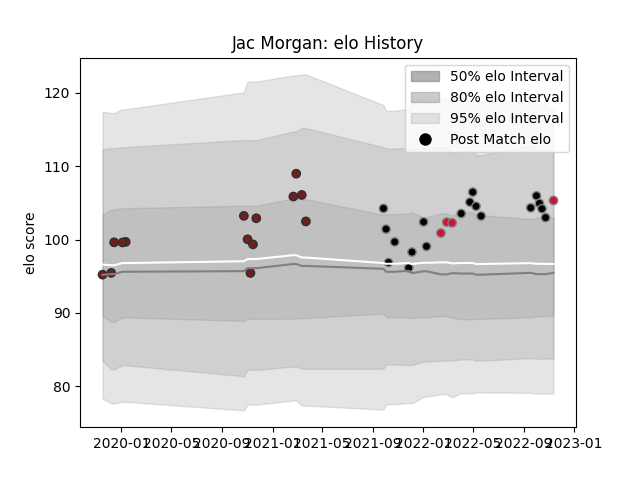

---  
layout: page  
title: Jac Morgan  
date: 2022-12-18 16:28:22.778266  
categories: player  
---
# Jac Morgan

## Positions: FL

## Country: Wales

## Current elo: 95.0

## Current Percentile: 45.0

# Elo History

# Match History

| Team     |   Appearances |   Win Rate |
|:---------|--------------:|-----------:|
| Ospreys  |            20 |   0.5      |
| Scarlets |            14 |   0.714286 |
| Wales    |             6 |   0.333333 |

| Opponent            |   Matches |   Win Rate |
|:--------------------|----------:|-----------:|
| Ulster              |         3 |   0.333333 |
| Cardiff Blues       |         3 |   1        |
| Connacht            |         3 |   0.666667 |
| Dragons             |         3 |   0.666667 |
| Scarlets            |         3 |   0.5      |
| Glasgow Warriors    |         2 |   0.5      |
| Bayonne             |         2 |   1        |
| Benetton Treviso    |         2 |   1        |
| Edinburgh           |         2 |   0.5      |
| Stormers            |         2 |   0.25     |
| Munster             |         2 |   0.5      |
| Montpellier Herault |         1 |   1        |
| Toulon              |         1 |   0        |
| Sharks              |         1 |   0        |
| Scotland            |         1 |   1        |
| Argentina           |         1 |   1        |
| London Irish        |         1 |   1        |
| Leicester Tigers    |         1 |   0        |
| Australia           |         1 |   0        |
| Georgia             |         1 |   0        |
| France              |         1 |   0        |
| England             |         1 |   0        |
| Bulls               |         1 |   0        |
| Zebre               |         1 |   1        |