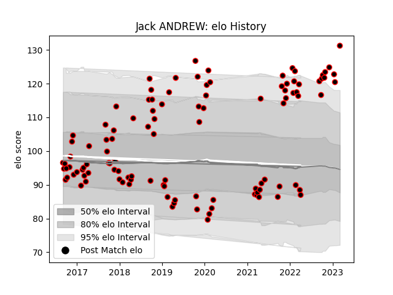

---  
layout: page  
title: Jack ANDREW  
date: 2023-01-19 11:39:50.998073  
categories: player  
---
# Jack ANDREW

## Positions: P

## Current elo: 117.0

## Current Percentile: 89.0

# Elo History

# Match History

| Team            |   Appearances |   Win Rate |
|:----------------|--------------:|-----------:|
| Cornish Pirates |           107 |   0.579439 |

| Opponent            |   Matches |   Win Rate |
|:--------------------|----------:|-----------:|
| Nottingham          |        11 |   0.818182 |
| Doncaster           |        10 |   0.8      |
| Ealing Trailfinders |        10 |   0.35     |
| Jersey              |        10 |   0.2      |
| Bedford             |        10 |   0.75     |
| London Scottish     |        10 |   0.6      |
| Richmond            |         9 |   0.722222 |
| Coventry            |         7 |   0.571429 |
| Yorkshire Carnegie  |         6 |   0.5      |
| Hartpury College    |         6 |   1        |
| Ampthill            |         5 |   0.7      |
| London Irish        |         4 |   0        |
| Rotherham Titans    |         3 |   0.333333 |
| Newcastle Falcons   |         2 |   0        |
| Bristol Rugby       |         2 |   0        |
| London Welsh        |         1 |   1        |
| Saracens            |         1 |   1        |