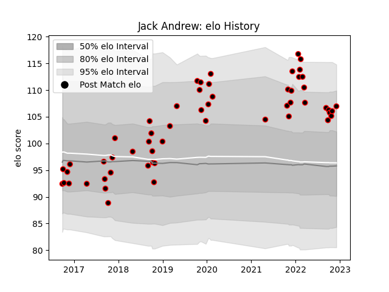

---  
layout: page  
title: Jack Andrew  
date: 2022-12-12 14:58:37.272595  
categories: player  
---
# Jack Andrew

## Positions: P

## Current elo: 107.0

## Current Percentile: 87.0

# Elo History

# Match History

| Team            |   Appearances |   Win Rate |
|:----------------|--------------:|-----------:|
| Cornish Pirates |            56 |   0.571429 |

| Opponent            |   Matches |   Win Rate |
|:--------------------|----------:|-----------:|
| Jersey              |         7 |   0.285714 |
| Doncaster           |         6 |   0.833333 |
| London Scottish     |         6 |   0.666667 |
| Nottingham          |         6 |   0.666667 |
| Bedford             |         5 |   0.5      |
| Coventry            |         5 |   0.6      |
| Ealing Trailfinders |         5 |   0.4      |
| Hartpury College    |         4 |   1        |
| Ampthill            |         3 |   0.666667 |
| London Irish        |         2 |   0        |
| Richmond            |         2 |   0.75     |
| Yorkshire Carnegie  |         2 |   0.5      |
| Bristol Rugby       |         1 |   0        |
| London Welsh        |         1 |   1        |
| Newcastle Falcons   |         1 |   0        |