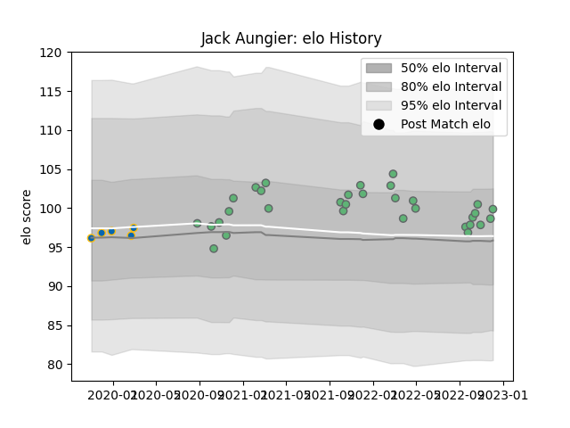

---  
layout: page  
title: Jack Aungier  
date: 2023-02-02 19:11:40.406469  
categories: player  
---
# Jack Aungier

## Positions: P

## Current elo: 111.0

## Current Percentile: 81.0

# Elo History

# Match History

| Team     |   Appearances |   Win Rate |
|:---------|--------------:|-----------:|
| Connacht |            39 |   0.538462 |
| Leinster |             5 |   1        |

| Opponent             |   Matches |   Win Rate |
|:---------------------|----------:|-----------:|
| Munster              |         5 |   0.4      |
| Ulster               |         3 |   0.666667 |
| Dragons              |         3 |   0.666667 |
| Edinburgh            |         3 |   0.333333 |
| Glasgow Warriors     |         3 |   1        |
| Scarlets             |         3 |   0.666667 |
| Leinster             |         3 |   0        |
| Ospreys              |         3 |   1        |
| Benetton Treviso     |         2 |   1        |
| Newcastle Falcons    |         2 |   0.5      |
| Stormers             |         2 |   0.5      |
| Lions                |         2 |   1        |
| Leicester Tigers     |         2 |   0        |
| Cardiff Blues        |         2 |   0.5      |
| Bulls                |         2 |   0.5      |
| Brive                |         1 |   1        |
| Sharks               |         1 |   0        |
| Stade Francais Paris |         1 |   1        |
| Zebre                |         1 |   1        |