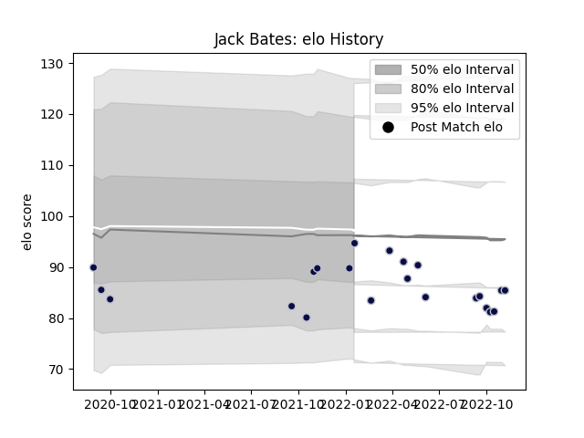

---  
layout: page  
title: Jack Bates  
date: 2023-03-17 17:28:48.514464  
categories: player  
---
# Jack Bates

## Positions: W, C

## Current elo: 95.0

## Current Percentile: 49.0

# Elo History

# Match History

| Team          |   Appearances |   Win Rate |
|:--------------|--------------:|-----------:|
| Bristol Rugby |            23 |   0.434783 |

| Opponent             |   Matches |   Win Rate |
|:---------------------|----------:|-----------:|
| Sale Sharks          |         4 |        0.5 |
| Saracens             |         3 |        0   |
| Exeter Chiefs        |         2 |        0.5 |
| Gloucester Rugby     |         2 |        0.5 |
| Leicester Tigers     |         2 |        0.5 |
| Newcastle Falcons    |         2 |        0   |
| Wasps                |         2 |        0.5 |
| Worcester Warriors   |         2 |        0.5 |
| Bath Rugby           |         1 |        1   |
| London Irish         |         1 |        1   |
| Northampton Saints   |         1 |        0   |
| Stade Francais Paris |         1 |        1   |