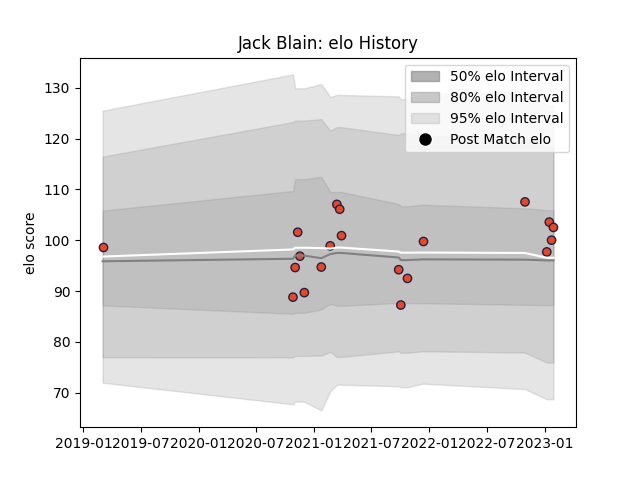

---  
layout: page  
title: Jack Blain  
date: 2023-02-02 18:47:30.629023  
categories: player  
---
# Jack Blain

## Positions: W, FB

## Current elo: 103.0

## Current Percentile: 62.0

# Elo History

# Match History

| Team      |   Appearances |   Win Rate |
|:----------|--------------:|-----------:|
| Edinburgh |            20 |       0.55 |

| Opponent          |   Matches |   Win Rate |
|:------------------|----------:|-----------:|
| Cardiff Blues     |         3 |   0.666667 |
| Zebre             |         3 |   1        |
| Benetton Treviso  |         2 |   0        |
| Connacht          |         2 |   0.5      |
| Saracens          |         2 |   1        |
| Scarlets          |         2 |   1        |
| Castres Olympique |         1 |   1        |
| Dragons           |         1 |   0        |
| Leinster          |         1 |   0        |
| Munster           |         1 |   0        |
| Sharks            |         1 |   0        |
| Ulster            |         1 |   0        |