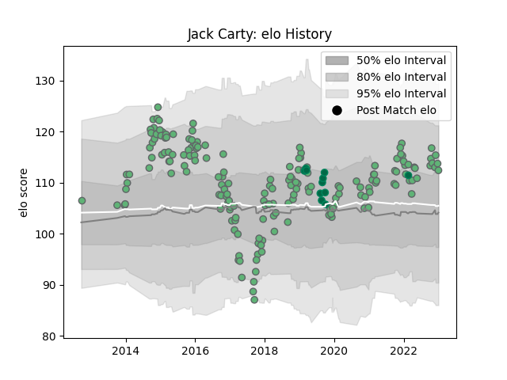

---  
layout: page  
title: Jack Carty  
date: 2023-02-02 18:48:48.258549  
categories: player  
---
# Jack Carty

## Positions: FH

## Country: Ireland

## Current elo: 97.0

## Current Percentile: 47.0

# Elo History

# Match History

| Team     |   Appearances |   Win Rate |
|:---------|--------------:|-----------:|
| Connacht |           184 |   0.497283 |
| Ireland  |            11 |   0.636364 |

| Opponent             |   Matches |   Win Rate |
|:---------------------|----------:|-----------:|
| Munster              |        16 |  0.3125    |
| Leinster             |        16 |  0.1875    |
| Ulster               |        14 |  0.428571  |
| Cardiff Blues        |        12 |  0.541667  |
| Benetton Treviso     |        12 |  0.833333  |
| Zebre                |        12 |  0.75      |
| Glasgow Warriors     |        11 |  0.0909091 |
| Scarlets             |        11 |  0.454545  |
| Dragons              |        10 |  0.7       |
| Edinburgh            |        10 |  0.4       |
| Ospreys              |        10 |  0.4       |
| Brive                |         5 |  0.8       |
| Cheetahs             |         4 |  0.75      |
| Stade Toulousain     |         4 |  0.25      |
| Gloucester Rugby     |         4 |  0.25      |
| Southern Kings       |         4 |  1         |
| Wales                |         3 |  0.666667  |
| Sharks               |         2 |  0.5       |
| Sale Sharks          |         2 |  0.5       |
| RC Enisei            |         2 |  1         |
| Wasps                |         2 |  0.5       |
| Stade Francais Paris |         2 |  0.5       |
| Montpellier Herault  |         2 |  0.5       |
| Newcastle Falcons    |         2 |  0.5       |
| Exeter Chiefs        |         2 |  0         |
| Lions                |         2 |  1         |
| Leicester Tigers     |         2 |  0         |
| Bordeaux Begles      |         2 |  1         |
| La Rochelle          |         2 |  1         |
| Italy                |         2 |  1         |
| France               |         2 |  0.5       |
| Worcester Warriors   |         1 |  1         |
| Bulls                |         1 |  1         |
| England              |         1 |  0         |
| Japan                |         1 |  0         |
| Perpignan            |         1 |  1         |
| Scotland             |         1 |  1         |
| Saracens             |         1 |  0         |
| Russia               |         1 |  1         |
| Bayonne              |         1 |  1         |