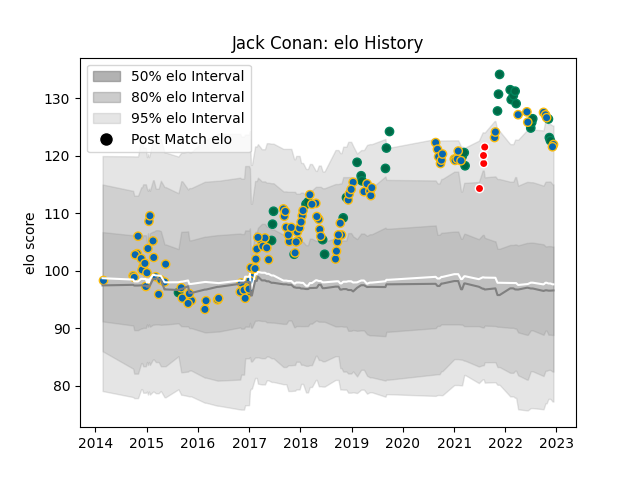

---  
layout: page  
title: Jack Conan  
date: 2022-11-15 23:36:25.600128  
categories: player  
---
# Jack Conan

## Positions: N8

## Country: Ireland

## Current elo: 124.0

## Current Percentile: 96.0

# Elo History

# Match History

| Team                    |   Appearances |   Win Rate |
|:------------------------|--------------:|-----------:|
| Leinster                |           110 |   0.759091 |
| Ireland                 |            33 |   0.878788 |
| British and Irish Lions |             4 |   0.5      |

| Opponent                 |   Matches |   Win Rate |
|:-------------------------|----------:|-----------:|
| Munster                  |        13 |   0.692308 |
| Ulster                   |        10 |   0.9      |
| Scarlets                 |        10 |   0.55     |
| Dragons                  |         9 |   0.777778 |
| Glasgow Warriors         |         7 |   0.928571 |
| Connacht                 |         7 |   0.571429 |
| Benetton Treviso         |         6 |   0.916667 |
| Cardiff Blues            |         6 |   1        |
| Zebre                    |         5 |   1        |
| Wasps                    |         5 |   0.7      |
| Wales                    |         5 |   0.8      |
| Scotland                 |         5 |   1        |
| Edinburgh                |         5 |   0.8      |
| South Africa             |         4 |   0.5      |
| New Zealand              |         4 |   0.75     |
| Japan                    |         4 |   1        |
| Italy                    |         4 |   1        |
| Montpellier Herault      |         3 |   1        |
| Castres Olympique        |         3 |   0.833333 |
| Stade Toulousain         |         3 |   0.666667 |
| Ospreys                  |         3 |   0.666667 |
| Harlequins               |         2 |   0.5      |
| Saracens                 |         2 |   0        |
| Bath Rugby               |         2 |   1        |
| United States of America |         2 |   1        |
| Australia                |         2 |   0.5      |
| England                  |         2 |   1        |
| Northampton Saints       |         2 |   1        |
| Exeter Chiefs            |         2 |   1        |
| Fiji                     |         2 |   1        |
| France                   |         2 |   0.5      |
| Racing 92                |         1 |   1        |
| Clermont Auvergne        |         1 |   0        |
| Cheetahs                 |         1 |   0        |
| Southern Kings           |         1 |   1        |
| Bulls                    |         1 |   0        |
| Argentina                |         1 |   1        |