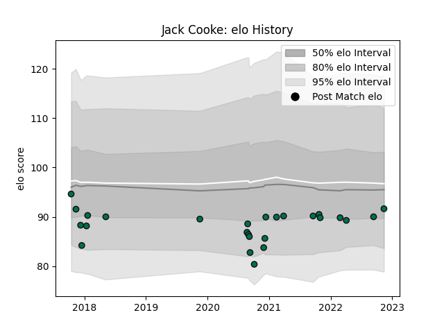

---  
layout: page  
title: Jack Cooke  
date: 2022-11-16 11:26:25.066006  
categories: player  
---
# Jack Cooke

## Positions: FL

## Current elo: 92.0

## Current Percentile: None

# Elo History

# Match History

| Team         |   Appearances |   Win Rate |
|:-------------|--------------:|-----------:|
| London Irish |            26 |   0.288462 |

| Opponent             |   Matches |   Win Rate |
|:---------------------|----------:|-----------:|
| Exeter Chiefs        |         3 |   0.333333 |
| Bath Rugby           |         2 |   0.5      |
| Bristol Rugby        |         2 |   0        |
| Edinburgh            |         2 |   0        |
| Gloucester Rugby     |         2 |   0        |
| Harlequins           |         2 |   0        |
| Krasny Yar           |         2 |   1        |
| Leicester Tigers     |         2 |   0.5      |
| Sale Sharks          |         2 |   0.25     |
| Worcester Warriors   |         2 |   0.5      |
| Agen                 |         1 |   1        |
| Northampton Saints   |         1 |   0        |
| Saracens             |         1 |   0        |
| Scarlets             |         1 |   0        |
| Stade Francais Paris |         1 |   0        |