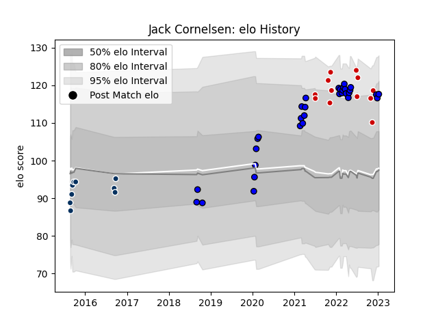

---  
layout: page  
title: Jack Cornelsen  
date: 2022-12-18 16:14:40.490389  
categories: player  
---
# Jack Cornelsen

## Positions: N8, L

## Country: Japan

## Current elo: 110.0

## Current Percentile: 89.0

# Elo History

# Match History

| Team                 |   Appearances |   Win Rate |
|:---------------------|--------------:|-----------:|
| Saitama Wild Knights |            29 |   0.982759 |
| Japan                |            11 |   0.181818 |
| Queensland Country   |             6 |   0.333333 |

| Opponent                          |   Matches |   Win Rate |
|:----------------------------------|----------:|-----------:|
| Yokohama Canon Eagles             |         5 |   1        |
| France                            |         3 |   0        |
| Toshiba Brave Lupus Tokyo         |         3 |   1        |
| Kobelco Kobe Steelers             |         3 |   0.833333 |
| Kubota Spears Funabashi Tokyo-Bay |         3 |   1        |
| NTT Docomo Red Hurricanes Osaka   |         2 |   1        |
| Black Rams Tokyo                  |         2 |   1        |
| Toyota Verblitz                   |         2 |   1        |
| Green Rockets Tokatsu             |         2 |   1        |
| Shizuoka Blue Revs                |         2 |   1        |
| Ireland                           |         2 |   0        |
| Sydney Stars                      |         1 |   0        |
| Tokyo Sungoliath                  |         1 |   1        |
| Portugal                          |         1 |   1        |
| Urayasu D-Rocks                   |         1 |   1        |
| Uruguay                           |         1 |   1        |
| Scotland                          |         1 |   0        |
| Australia                         |         1 |   0        |
| North Harbour Rays                |         1 |   0        |
| New Zealand                       |         1 |   0        |
| Mitsubishi Dynaboars              |         1 |   1        |
| Melbourne Rising                  |         1 |   0        |
| Hino Red Dolphins                 |         1 |   1        |
| Greater Sydney Rams               |         1 |   1        |
| England                           |         1 |   0        |
| Coca-Cola Red Sparks              |         1 |   1        |
| Brisbane City                     |         1 |   0        |
| NSW Country Eagles                |         1 |   1        |