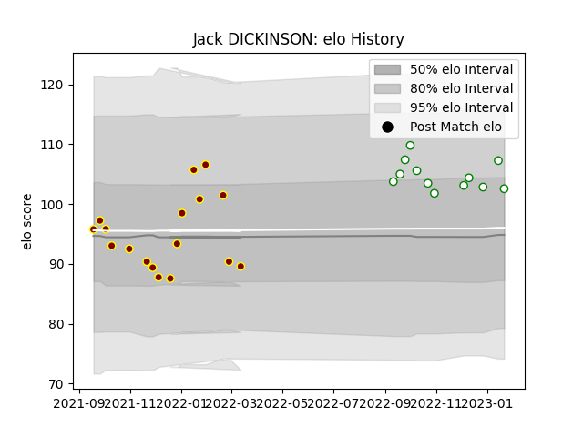

---  
layout: page  
title: Jack DICKINSON  
date: 2023-02-02 15:50:01.854207  
categories: player  
---
# Jack DICKINSON

## Positions: H

## Current elo: 100.0

## Current Percentile: 71.0

# Elo History

# Match History

| Team       |   Appearances |   Win Rate |
|:-----------|--------------:|-----------:|
| Ampthill   |            17 |   0.470588 |
| Nottingham |            13 |   0.307692 |

| Opponent            |   Matches |   Win Rate |
|:--------------------|----------:|-----------:|
| Doncaster           |         4 |   0.25     |
| Bedford             |         3 |   0.333333 |
| Coventry            |         3 |   0.333333 |
| Ealing Trailfinders |         3 |   0        |
| Hartpury College    |         3 |   0.333333 |
| London Scottish     |         3 |   1        |
| Richmond            |         3 |   1        |
| Caldy               |         2 |   0.5      |
| Cornish Pirates     |         2 |   0        |
| Jersey              |         2 |   0        |
| Nottingham          |         2 |   0.5      |