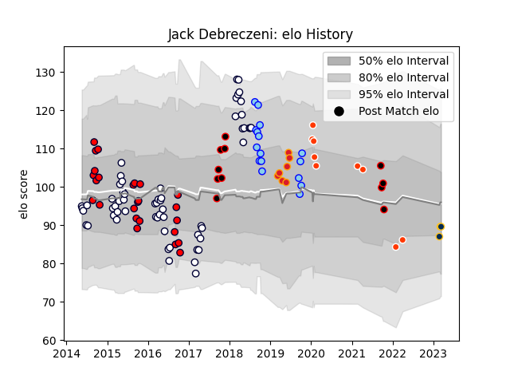

---  
layout: page  
title: Jack Debreczeni  
date: 2023-03-21 18:42:04.169775  
categories: player  
---
# Jack Debreczeni

Last updated: 2023-03-21
## Positions: FH, FB

## Current elo: 90.0

## Current Percentile: 33.0

# Elo History

# Match History

| Team              |   Appearances |   Win Rate |
|:------------------|--------------:|-----------:|
| Melbourne Rebels  |            58 |   0.37069  |
| Melbourne Rising  |            25 |   0.64     |
| Northland         |            16 |   0.3125   |
| Hino Red Dolphins |             9 |   0.111111 |
| Chiefs            |             7 |   0.571429 |
| Mie Honda Heat    |             7 |   1        |
| Brumbies          |             4 |   1        |
| Canterbury        |             4 |   0.5      |

| Opponent                          |   Matches |   Win Rate |
|:----------------------------------|----------:|-----------:|
| Queensland Reds                   |        10 |   0.7      |
| New South Wales Waratahs          |         8 |   0.25     |
| Brumbies                          |         7 |   0.571429 |
| Crusaders                         |         5 |   0.4      |
| Bulls                             |         5 |   0.4      |
| NSW Country Eagles                |         4 |   0.5      |
| Blues                             |         4 |   0.5      |
| Perth Spirit                      |         4 |   0.25     |
| Canberra Vikings                  |         4 |   0.5      |
| Hurricanes                        |         4 |   0        |
| Queensland Country                |         3 |   1        |
| Sharks                            |         3 |   0.5      |
| Highlanders                       |         3 |   0        |
| Greater Sydney Rams               |         3 |   0.666667 |
| Western Force                     |         3 |   0.666667 |
| Stormers                          |         3 |   0        |
| Brisbane City                     |         3 |   0.666667 |
| Waikato                           |         3 |   0.333333 |
| Chiefs                            |         3 |   0.333333 |
| Lions                             |         2 |   0        |
| Wellington                        |         2 |   0        |
| North Harbour Rays                |         2 |   1        |
| Otago                             |         2 |   0.5      |
| Bay of Plenty                     |         2 |   0        |
| Sydney Stars                      |         2 |   1        |
| Jaguares                          |         2 |   0        |
| Southland                         |         2 |   1        |
| Hawke's Bay                       |         2 |   0        |
| Sunwolves                         |         2 |   1        |
| Shizuoka Blue Revs                |         2 |   0        |
| Taranaki                          |         1 |   1        |
| Toyota Verblitz                   |         1 |   0        |
| Southern Kings                    |         1 |   0        |
| Urayasu D-Rocks                   |         1 |   0        |
| Tasman                            |         1 |   0        |
| North Harbour                     |         1 |   0        |
| Auckland                          |         1 |   0        |
| Moana Pasifika                    |         1 |   1        |
| Green Rockets Tokatsu             |         1 |   1        |
| Black Rams Tokyo                  |         1 |   0        |
| Canterbury                        |         1 |   0        |
| Cheetahs                          |         1 |   1        |
| Cheethas                          |         1 |   1        |
| Chubu Electric Power              |         1 |   1        |
| Chugoku Red Regulions             |         1 |   1        |
| Counties Manukau                  |         1 |   1        |
| Hanazono Kintetsu Liners          |         1 |   0        |
| Mitsubishi Dynaboars              |         1 |   1        |
| Hino Red Dolphins                 |         1 |   1        |
| Kamaishi Seawaves                 |         1 |   1        |
| Kubota Spears Funabashi Tokyo-Bay |         1 |   0        |
| Kyuden Voltex                     |         1 |   1        |
| Mazda Blue Zoomers                |         1 |   1        |
| Melbourne Rebels                  |         1 |   1        |
| Mie Honda Heat                    |         1 |   0        |
| Manawatu                          |         1 |   1        |