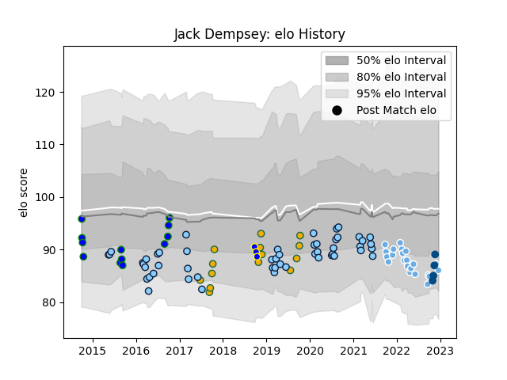

---  
layout: page  
title: Jack Dempsey  
date: 2022-11-15 23:41:14.719556  
categories: player  
---
# Jack Dempsey

## Positions: N8, FL

## Country: Scotland

## Current elo: 82.0

## Current Percentile: 7.0

# Elo History

# Match History

| Team                     |   Appearances |   Win Rate |
|:-------------------------|--------------:|-----------:|
| New South Wales Waratahs |            51 |   0.352941 |
| Glasgow Warriors         |            20 |   0.45     |
| Australia                |            14 |   0.642857 |
| North Harbour Rays       |             5 |   0.1      |
| Scotland                 |             3 |   0.333333 |

| Opponent         |   Matches |   Win Rate |
|:-----------------|----------:|-----------:|
| Brumbies         |         8 |   0        |
| Melbourne Rebels |         6 |   0.333333 |
| Queensland Reds  |         6 |   0.666667 |
| Western Force    |         5 |   0.8      |
| Blues            |         4 |   0        |
| Sharks           |         4 |   0.5      |
| Chiefs           |         4 |   0.25     |
| Crusaders        |         4 |   0.5      |
| New Zealand      |         3 |   0.333333 |
| South Africa     |         3 |   0.333333 |
| Benetton Treviso |         3 |   0.333333 |
| Lions            |         3 |   0.666667 |
| Highlanders      |         3 |   0        |
| Leinster         |         2 |   0        |
| Italy            |         2 |   1        |
| Hurricanes       |         2 |   0        |
| Argentina        |         2 |   1        |
| Sunwolves        |         2 |   1        |
| Cardiff Blues    |         2 |   0.5      |
| Brisbane City    |         2 |   0        |
| Edinburgh        |         2 |   0.5      |
| Stormers         |         1 |   0        |
| Sydney Stars     |         1 |   0        |
| Ulster           |         1 |   0        |
| Uruguay          |         1 |   1        |
| Wales            |         1 |   0        |
| Scarlets         |         1 |   0        |
| Samoa            |         1 |   1        |
| Jaguares         |         1 |   0        |
| Ospreys          |         1 |   0        |
| Munster          |         1 |   1        |
| Melbourne Rising |         1 |   0        |
| Australia        |         1 |   0        |
| Georgia          |         1 |   1        |
| Fiji             |         1 |   1        |
| England          |         1 |   0        |
| Dragons          |         1 |   1        |
| Connacht         |         1 |   1        |
| Cheetahs         |         1 |   1        |
| Canberra Vikings |         1 |   0.5      |
| Bulls            |         1 |   0        |
| Zebre            |         1 |   1        |