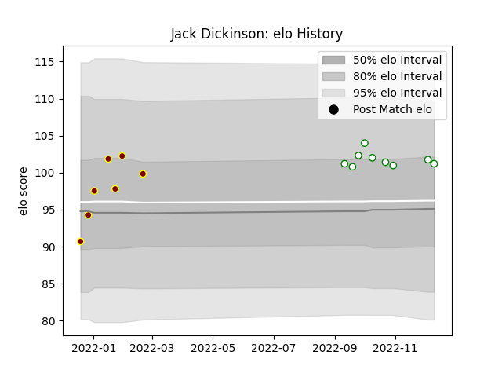

---  
layout: page  
title: Jack Dickinson  
date: 2022-12-14 11:20:40.426737  
categories: player  
---
# Jack Dickinson

## Positions: H

## Current elo: 101.0

## Current Percentile: 75.0

# Elo History

# Match History

| Team       |   Appearances |   Win Rate |
|:-----------|--------------:|-----------:|
| Nottingham |             9 |   0.444444 |
| Ampthill   |             7 |   0.571429 |

| Opponent            |   Matches |   Win Rate |
|:--------------------|----------:|-----------:|
| Bedford             |         2 |        0.5 |
| Doncaster           |         2 |        0.5 |
| Jersey              |         2 |        0   |
| London Scottish     |         2 |        1   |
| Richmond            |         2 |        1   |
| Caldy               |         1 |        1   |
| Cornish Pirates     |         1 |        0   |
| Coventry            |         1 |        0   |
| Ealing Trailfinders |         1 |        0   |
| Hartpury College    |         1 |        0   |
| Nottingham          |         1 |        1   |