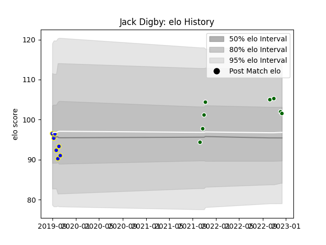

---  
layout: page  
title: Jack Digby  
date: 2022-12-18 16:25:30.086464  
categories: player  
---
# Jack Digby

## Positions: FL, L

## Current elo: 102.0

## Current Percentile: 71.0

# Elo History

# Match History

| Team                |   Appearances |   Win Rate |
|:--------------------|--------------:|-----------:|
| Ealing Trailfinders |             8 |   1        |
| Sydney Rays         |             7 |   0.142857 |

| Opponent           |   Matches |   Win Rate |
|:-------------------|----------:|-----------:|
| Bedford            |         2 |          1 |
| Nottingham         |         2 |          1 |
| Brisbane City      |         1 |          0 |
| Canberra Vikings   |         1 |          0 |
| Cornish Pirates    |         1 |          1 |
| Coventry           |         1 |          1 |
| Fijian Drua        |         1 |          0 |
| London Scottish    |         1 |          1 |
| Melbourne Rising   |         1 |          0 |
| NSW Country Eagles |         1 |          0 |
| Queensland Country |         1 |          1 |
| Richmond           |         1 |          1 |
| Western Force      |         1 |          0 |