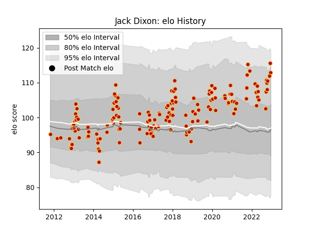

---  
layout: page  
title: Jack Dixon  
date: 2023-01-17 11:40:30.200239  
categories: player  
---
# Jack Dixon

## Positions: C

## Current elo: 117.0

## Current Percentile: 87.0

# Elo History

# Match History

| Team    |   Appearances |   Win Rate |
|:--------|--------------:|-----------:|
| Dragons |           160 |    0.31875 |

| Opponent             |   Matches |   Win Rate |
|:---------------------|----------:|-----------:|
| Scarlets             |        15 |   0.266667 |
| Ospreys              |        14 |   0.25     |
| Cardiff Blues        |        13 |   0.153846 |
| Benetton Treviso     |        11 |   0.363636 |
| Leinster             |        11 |   0.181818 |
| Edinburgh            |        11 |   0.272727 |
| Zebre                |        10 |   0.45     |
| Munster              |        10 |   0.1      |
| Connacht             |        10 |   0.4      |
| Ulster               |         7 |   0.357143 |
| Glasgow Warriors     |         6 |   0.416667 |
| Southern Kings       |         4 |   0.625    |
| RC Enisei            |         3 |   0.666667 |
| Wasps                |         3 |   0.333333 |
| Sharks               |         2 |   0        |
| Pau                  |         2 |   0.5      |
| Worcester Warriors   |         2 |   0.5      |
| Northampton Saints   |         2 |   0        |
| Newcastle Falcons    |         2 |   0.5      |
| London Welsh         |         2 |   1        |
| Mogliano             |         2 |   1        |
| Lions                |         2 |   0.25     |
| Cheetahs             |         2 |   0.5      |
| Castres Olympique    |         2 |   0.5      |
| Bordeaux Begles      |         2 |   0.5      |
| Montpellier Herault  |         1 |   0        |
| Bayonne              |         1 |   0        |
| Leicester Tigers     |         1 |   0        |
| Gloucester Rugby     |         1 |   0        |
| Exeter Chiefs        |         1 |   0        |
| Clermont Auvergne    |         1 |   0        |
| Stade Francais Paris |         1 |   1        |
| Timisoara Saracens   |         1 |   1        |
| Bulls                |         1 |   0        |
| Bath Rugby           |         1 |   0        |