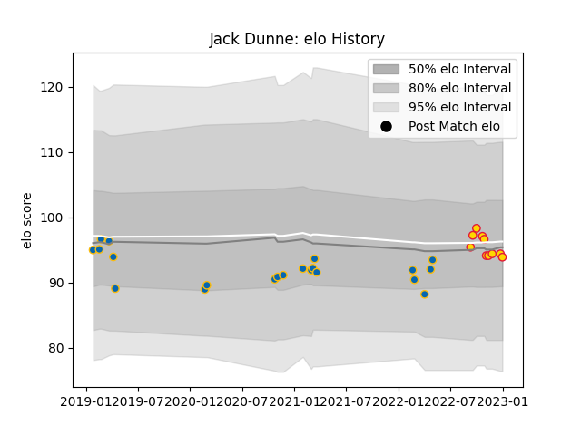

---  
layout: page  
title: Jack Dunne  
date: 2022-11-16 11:32:34.429355  
categories: player  
---
# Jack Dunne

## Positions: L

## Current elo: 98.0

## Current Percentile: 65.0

# Elo History

# Match History

| Team          |   Appearances |   Win Rate |
|:--------------|--------------:|-----------:|
| Leinster      |            21 |   0.738095 |
| Exeter Chiefs |             7 |   0.428571 |

| Opponent           |   Matches |   Win Rate |
|:-------------------|----------:|-----------:|
| Glasgow Warriors   |         4 |   0.75     |
| Ospreys            |         3 |   0.666667 |
| Zebre              |         3 |   1        |
| Scarlets           |         2 |   1        |
| Edinburgh          |         1 |   0        |
| Saracens           |         1 |   0        |
| Worcester Warriors |         1 |   1        |
| Ulster             |         1 |   1        |
| Stormers           |         1 |   0        |
| Southern Kings     |         1 |   1        |
| Sharks             |         1 |   0        |
| Sale Sharks        |         1 |   0        |
| Gloucester Rugby   |         1 |   0        |
| Cardiff Blues      |         1 |   1        |
| Northampton Saints |         1 |   0        |
| Munster            |         1 |   1        |
| London Irish       |         1 |   1        |
| Lions              |         1 |   1        |
| Leicester Tigers   |         1 |   1        |
| Benetton Treviso   |         1 |   0.5      |